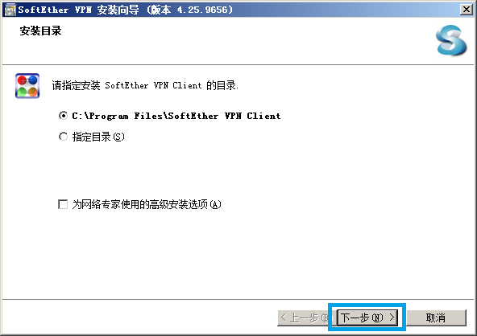

## SoftEther VPN

<https://www.softether.org>


### vpncmd 常用命令

网卡

```
创建 NicCreate
删除 NicDelete
查看 NicList
```

连接

```
创建 AccountCreate
密码 AccountPasswordSet
删除 AccountDelete
自连 AccountStartupSet
连接 AccountConnect
断开 AccountDisconnect
查看 AccountList
```


### VPN client 安装步骤：

1. 下载软件

2. 点击下载后的软件执行安装

3. 下一步  
   

4. 下一步  
   

5. 下一步  
   

6. 下一步  
   

7. 下一步  
   

8. 下一步，然后等待几秒  
   

9. 完成  
   

10. 新建虚拟网卡  
    

11. 确认，然后等待几秒  
    

12. 创建连接  
    

13. 填写提供的信息并确认  
    

14. 连接  
    


