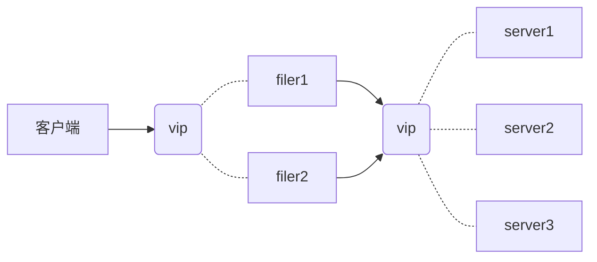

## seaweedfs

<https://github.com/chrislusf/seaweedfs/wiki>

是一个简单且高度可扩展的分布式文件系统

1.  存储数十亿个小文件
2.  快速提供文件

SeaweedFS中的服务器通常支持两种操作

*   gRPC
    *   使用 HTTP/2 进行传输
        *   支持多种工作模式（自由流传输）
    *   使用 Protocol Buffers 作为接口描述语言
        *   非常高效的数据打包方式
    *   不能期望在浏览器中使用 grpc api
*   REST
    *   使用 HTTP/1.x 进行传输
        *   仅仅支持请求响应模型
    *   通常使用 json
        *   字符串可以压缩
    *   浏览器完美支持


## 安装

```shell
# download
wget -c $(https://github.com/chrislusf/seaweedfs/releases)
tar -xvf linux_amd64.tar.gz

# ./weed scaffold -config=security

# data dir
mkdir -p /opt/weed/data

./weed master -mdir /opt/weed/data
```


卷服务器分布在不同的计算机上

可以具有不同的磁盘空间，甚至不同的操作系统

需要指定可用磁盘空间，Weed Master位置和存储目录

```shell
# 同时启用主服务器和卷服务器
weed server -master.port=9333 -volume.port=8080 -dir="/opt/weed"
```


## 使用

#### 上传/更新 文件

```shell
# 以获取fid卷和服务器URL
curl -s http://localhost:9333/dir/assign
# {"fid":"3,01637037d6","url":"localhost:8080","publicUrl":"localhost:8080","count":1}

# 更新内容
curl -F file=@/etc/hosts http://localhost:8080/3,01637037d6
# {"name":"hosts","size":186,"eTag":"e510f967"}
```

现在将 `3,01637037d6` 存储到数据库字段中

*   开头的数字3表示卷ID。在逗号之后，它是一个文件密钥01和一个文件cookie 637037d6
*   用于防止URL猜测
    *   卷id是无符号的32位整数
        *   内部：四字节的整数
            *   最大 `2^32 = 4294967296`, 最小 `0`
        *   存储：4字节的整数
    *   文件密钥是无符号的64位整数
        *   内部：十六进制编码
            *   最大 `2^64 = 1.8446744e+19`, 最小 `0`
        *   存储：8字节的长整数
    *   文件cookie是无符号的32位整数
        *   内部：十六进制编码
            *   最大 `2^32 = 4294967296`, 最小 `0`
        *   存储：4字节的整数

>   注意：存储数据字段到数据库，请检查有足够的空间，检查上面的`存储:`，所以16个字节绰绰有余

#### 获取/下载 文件

```shell
# 使用存储中的id查找卷服务器的URL
curl -s http://localhost:9333/dir/lookup?volumeId=$(id)
# {"volumeId":"3","locations":[{"url":"localhost:8080","publicUrl":"localhost:8080"}]}

# 获取文件, 后缀是可选，只是客户端指定文件内容类型的一种方式
curl -s http://localhost:8080/3/01637037d6/my_preferred_name.txt
curl -s http://localhost:8080/3/01637037d6.txt
curl -s http://localhost:8080/3,01637037d6.txt
curl -s http://localhost:8080/3/01637037d6
curl -s http://localhost:8080/3,01637037d6

# 或者获取压缩版本
http://localhost:8080/3/01637037d6.txt?height=200&width=200
http://localhost:8080/3/01637037d6.txt?height=200&width=200&mode=fit
http://localhost:8080/3/01637037d6.txt?height=200&width=200&mode=fill
```

#### 删除 文件

```shell
curl -X DELETE http://localhost:8080/3,01637037d6
```


## 状态

```shell
# master
curl -s http://localhost:9333/cluster/status
curl -s http://localhost:9333/dir/status

# volume
curl -s http://localhost:8080/status
```


#### web ui

```shell
# master
http://192.168.56.101:9333

# volume
http://localhost:8080/ui/index.html
```

#### 大文件支持

大文件会被自动分割成块，在 `weed filer` `weed mount` 等等。

#### 大于30GB的卷

从1.29开始，有单独的版本，`_large_disk`在文件名中：

-   darwin_amd64_large_disk.tar.gz
-   linux_amd64_large_disk.tar.gz
-   windows_amd64_large_disk.zip

这些版本与普通的30GB版本不兼容。该`large disk`版本对每个文件条目使用17个字节，而以前每个文件条目需要16个字节。


## 复制

*   概念

```
defaultReplication 复制类型

000  没有复制，只有一个副本
001  在同一个机架上复制一次
010  在同一数据中心的不同机架上复制一次
100  在不同的数据中心复制一次
200  在另外两个不同的数据中心复制两次
110  在不同的机架上复制一次，在不同的数据中心复制一次
...  ...

=xyz
x  - 复制的数量，在 数据中心
y  - 复制的数量，在 物理服务器 in the 同一个数据中心
z  - 复制的数量，在 服务端 in the 同一个物理服务器
x,y,z  - 0,1,2
意味着rack最大只能3个，dataCenter最大只能三个
```

*   操作

```shell
# dataCenter 当前卷服务器的数据中心名称
# rack       当前卷服务器的机架名称

weed master -defaultReplication=002 -port=9333 -mdir=/tmp/m1

weed volume -rack=rack1 -dir=/tmp/v1 -port=8080 -mserver=localhost:9333
weed volume -rack=rack1 -dir=/tmp/v2 -port=8081 -mserver=localhost:9333
weed volume -rack=rack1 -dir=/tmp/v3 -port=8082 -mserver=localhost:9333
```


## 文件TTL

假设我们要存储TTL为3分钟的文件，到期后返回 http code 404

首先，要求主服务器将文件ID分配给具有3分钟TTL的卷：

```shell
curl http://localhost:9333/dir/assign?ttl=30s
# {"count":1,"fid":"5,01637037d6","url":"127.0.0.1:8080","publicUrl":"localhost:8080"}
```

上传文件

```shell
curl -F "file=@x.go" http://127.0.0.1:8080/5,01637037d6?ttl=3m
```

支持的TTL格式示例

```shell
'm'分，'h'时，'d'天，'w'周，'M'月，'y'年
```

>   `ttl=3m` 使用了两次，没有什么特殊的含义，只是简化了seaweedfs内部TTL卷的管理


## 故障转移

主服务器由Raft协议协调，以选举leader。leader接管所有的工作，管理卷、分配文件ID
所有其他主服务器只是简单地将请求转发给leader

通常会启动3/5个主服务器，然后启动卷服务器

```shell
weed master -port=9333 -mdir=/tmp/m1 -peers=localhost:9333,localhost:9334,localhost:9335
weed master -port=9334 -mdir=/tmp/m2 -peers=localhost:9333,localhost:9334,localhost:9335
weed master -port=9335 -mdir=/tmp/m3 -peers=localhost:9333,localhost:9334,localhost:9335

weed volume -dir=/tmp/v1 -port=8080 -mserver=localhost:9333,localhost:9334,localhost:9335
weed volume -dir=/tmp/v2 -port=8081 -mserver=localhost:9333,localhost:9334,localhost:9335
weed volume -dir=/tmp/v3 -port=8082 -mserver=localhost:9333,localhost:9334,localhost:9335
```

>   客户端可检查leader，从而实现高可用


## 备份

1.  直接备份源数据文件

    ```shell
    tar -czvf "/opt/backup/seaweedfs-$(date '+%Y%m%d-%H%M%S').tar.gz" "/opt/seaweedfs"
    ```

2.  使用备份工具

    ```shell
    BackupDir="/opt/backup/seaweedfs"
    [[ ! -d "${BackupDir}" ]] && mkdir -p "${BackupDir}"
    for (( i = 0; i < $(max_volume_id); i++ )) {
        weed backup -server="127.0.0.1:9333" -dir="${BackupDir}" -volumeId="${i}"
        sleep 6s
    }
    tar -czvf "${BackupDir}-$(date '+%Y%m%d-%H%M%S').tar.gz" "${BackupDir}"
    rm -rf "${BackupDir}"
    ```

### 还原

```shell
tar -xvf "/opt/backup/seaweedfs-$(date '+%Y%m%d-%H%M%S').tar.gz" -C "/opt/seaweedfs"
```


## 目录和文件

在谈论文件系统时，许多人会假设目录，在目录下列出文件等等

Filer有一个连接到Master的持久客户端，以获取所有卷的位置更新。没有网络往返来查找卷ID位置。

现在您可以添加/删除文件，甚至可以浏览子目录和文件

上传

```shell
curl -F "f=@README.md" "http://localhost:8888/path/to/sources/"
curl -F "f=@README.md" "http://localhost:8888/path/to/sources/new_name"
```

下载

```shell
curl "http://localhost:8888/path/to/sources/new_name"
```

列出文件及目录

```shell
curl -s -H 'Accept: application/json' "http://localhost:8888"
```

删除文件

```shell
curl -X DELETE "http://localhost:8888/path/to/sources/new_name"
```

删除目录中所有文件

```shell
curl -X DELETE "http://localhost:8888/path/to/sources/dir?recursive=true"
```

问题：必须手动指定leader master

>    解决：中间可以增加机器集群分发器指定leader

问题：大文件(>100MB)上传时，复制不会全部一样


## 挂载目录

支持本地文件操作，fuse虚拟出linux环境的目录

```shell
sudo yum install -y fuse
sudo weed mount -filer=localhost:8888 -dir=/opt/dir
```


# 基本架构



*   `server[1,2,3]` 每台机器上面跑了一个volume和master
*   `server[1,2,3]` 在一个集群中，之间有配置复制
*   `server[1,2,3]` 之间用keepalived的vip做高可用，vip指向leader
*   `filer[1,2]` 上面跑着filer，指向server的vip
*   `filer[1,2]` 之间用keepalived的vip做高可用，vip检测本应用存活
*   客户端只需要请求filer的vip

```shell
# server[1,2,3]

rm -rf   /tmp/{m{1,2,3},v{1,2,3}}
mkdir -p /tmp/{m{1,2,3},v{1,2,3}}

weed master -defaultReplication=002 -port=9333 -mdir=/tmp/m1 \
  -peers=localhost:9333,localhost:9334,localhost:9335
weed master -defaultReplication=002 -port=9334 -mdir=/tmp/m2 \
  -peers=localhost:9333,localhost:9334,localhost:9335
weed master -defaultReplication=002 -port=9335 -mdir=/tmp/m3 \
  -peers=localhost:9333,localhost:9334,localhost:9335

weed volume -rack=rack1 -dir=/tmp/v1 -port=8080  \
  -mserver=localhost:9333,localhost:9334,localhost:9335
weed volume -rack=rack1 -dir=/tmp/v2 -port=8081 \
  -mserver=localhost:9333,localhost:9334,localhost:9335
weed volume -rack=rack1 -dir=/tmp/v3 -port=8082 \
  -mserver=localhost:9333,localhost:9334,localhost:9335
```

```shell
# filer[1,2]
```


