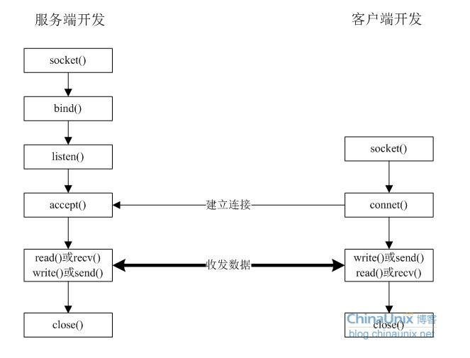

## 网络编程

### 字节序：

考虑一个16位整数，它由两个字节组成，内存以两种方式存储数据

1. 小端字节序，将低序字节存储在起始地址
2. 大端字节序，将高序字节存储在起始地址

术语 **小端**、**大端** 表示多个字节值的哪一端（小端或大端）存储在该值的起始地址

遗憾的是两种字节序之间没有标准可循，两种格式都有系统使用

我们将某个系统所使用的字节序称为主机字节序

**网际协议使用大端**字节序

使用这些函数时，我们并不关心主机字节序和网络字节序的真实值（或位大端、或为小端），

只需调用函数转换为需要的主机字节序或网络字节序

### 地址字节序转换函数：

地址的文本表达（ASCII字符串） 和 套接字地址结构的二进制 之间进行转换

##### 旧函数，仅仅适用 **ipv4**：

* in\_addr\_t inet\_addr\( const char \*\_\_cp \)
* char \*inet\_ntoa\( struct in\_addr \_\_in \)

##### 新函数，同时适用 **ipv6**：

函数的 fammily 参数即可以是 AF\_INET，也可以是 AF\_INET6，如果以不支持的地址族作为 fammily参数，一下两个函数就都会返回一个错误，并将 errno 置为 EAFNOSUPPORT，Address family not supported by protocol（协议的地址族不支持

```c
int inet_pton( int __af, const char *__restrict __cp, void *__restrict __buf );
```

字符串转换为地址的二进制格式，成功返回 1，格式无效返回 0，出错返回 -1

```c
const char *inet_ntop( int __af, const void *__restrict __cp, char *__restrict __buf, socklen_t __len );
```

地址的二进制格式转换为地址的字符串，缓冲区大小至少为 INET6\_ADDRSTRLEN 或 INET\_ADDRSTRLEN，成功返回指向结果的指针，出错为NULL

#### 协议无关函数

为了使用这些函数，我们必须指定这个结构的格式和地址族，例如：

ipv4

```c
struct sockaddr_in addr;
inet_ntop( AF_INET, &addr.sin_addr, str, sizeof( str) );
```

ipv6

```c
struct sockaddr_in6 addr6;
inet_ntop( AF_INET6, &addr6.sin6_addr, str, sizeof( str) );
```

这就使我们的代码与协议相关了

```c
char *sock_ntop( const struct sockaddr_storage *sa )
{
    uint16_t             port;      // 65535
    char                 addr[40];  // FFFF:FFFF:FFFF:FFFF:FFFF:FFFF:FFFF:FFFF
    static char          str[48];   // [FFFF:FFFF:FFFF:FFFF:FFFF:FFFF:FFFF:FFFF]:65535
    struct sockaddr_in  *sin;
    struct sockaddr_in6 *sin6;

    switch ( sa->ss_family )
    {
        case AF_INET:
            sin = (struct sockaddr_in *) sa;
            if ( inet_ntop( AF_INET, &sin->sin_addr, addr, sizeof( addr ) ) == NULL )
                return NULL;
            if ( ( port = ntohs( sin->sin_port ) ) != 0 )
                snprintf( str, sizeof( str ), "%s:%u", addr, port );
            break;

        case AF_INET6:
            sin6 = (struct sockaddr_in6 *) sa;
            if ( inet_ntop( AF_INET, &sin6->sin6_addr, addr, sizeof( addr ) ) == NULL )
                return NULL;
            if ( ( port = ntohs( sin6->sin6_port ) ) != 0 )
                snprintf( str, sizeof( str ), "[%s]:%u", addr, port );
            break;

        default:
            return NULL;
    }

    return str;
}
```

> p 表示（表达 presentation），n 表示（数值 numeric）
>
> 表达格式通常为ASCII字符串，数值格式为存放到套接字地址结构中的二进制值


## 占位符

### 一、printf\(\)

printf\(\)的返回值为输出的字符个数：

* 例：rv = printf \("hello"\);  结果为rv = 5;

转换说明

```
%a  - 浮点数、十六进制数和p-记数法(C99)
%A  - 浮点数、十六进制数和p-记数法(C99)

%s  - 一条字符串，任何
%c  - 一个字符，仅仅变量

%u  - 无符号十进制整数
%d  - 有符号十进制整数
%i  - 有符号十进制整数（与%d相同）

%hu  - 输出一个unsigned short int类型的数值，此类型占两个字节，范围为0到65535（2^16-1）
%hhu - 用于输出一个unsigned short类型的数值，此类型占一个字节，范围为0到255（2^8-1）

%ld  - long
%lld - long long

%x  - 表示按16进制输出

%zu - 有符号转换为无符号类型
%zd - 无符号类型转换为有符号类型

%e  - 浮点数、e-记数法
%E  - 浮点数、E-记数法
%f  - 浮点数、十进制记数法
%g  - 根据数值不同自动选择%f或%e。%e格式在指数小于-4或者大于等于精度时使用
%G  - 根据数值不同自动选择%f或%E。%E格式在指数小于-4或者大于等于精度时使用
%o  - 无符号八进制整数
%p  - 指针
%x  - 使用十六进制数字0f的无符号十六进制整数
%X  - 使用十六进制数字0F的无符号十六进制整数
%%  - 打印一个百分号
```


## 执行命令

---

#### fork

```c
#include <unistd.h>

pid_t cpid = fork();
```

返回值

* `cpid = -1` 错误，并设置errno
* `cpid = 0` 当前是子进程
* `cpid > 0` 当前是父进程，cpid是子进程的pid

示例

```c
const pid_t cpid = fork();

switch (cpid) {

    case -1: {
        perror("fork");
        return -1;
    }

    case 0: {
        // 子进程执行函数
        _exit(127);
    }

    default: {
        // 等待子进程结束
        pid_t w;
        do {
            w = wait(NULL);
        } while (w != cpid);
    }
}
```


#### wait

```c
#include <sys/types.h>
#include <sys/wait.h>

pid_t wait(int *status);
```

* 入参 status
  * `NULL`如果不需要子进程的退出状态
  * `WIFEXITED(status)`：如果子进程正常结束，为`true`
  * `WEXITSTATUS(status)`：取得子进程exit\(\)返回的结束代码，一般会先用`WIFEXITED`来判断是否正常结束才能使用此宏
  * `WIFSIGNALED(status)`：如果子进程是因为信号而结束，为`true`
  * `WTERMSIG(status)`：取得子进程因信号而中止的信号代码，一般会先用`WIFSIGNALED`来判断后才使用此宏
  * `WIFSTOPPED(status)`：如果子进程处于暂停执行，为`true`，一般只有使用`WUNTRACED`时才会有此情况
  * `WSTOPSIG(status)`：取得引发子进程暂停的信号代码，一般会先用`WIFSTOPPED`来判断后才使用此宏
* 返回
  * 成功：已结束运行的子进程的PID
  * 失败：-1（如果不存在子进程）


##### waitpid

```c
#include <sys/types.h>
#include <sys/wait.h>

pid_t waitpid(pid_t pid, int *status, int options);
```

*   入参 pid
    *   `pid > 0`：只等待指定进程，不管有其他的子进程
    *   `pid == -1`：等待任何一个子进程，等同于 `wait()`
    *   `pid == 0`：等待其组ID等于调用进程的组ID的任一进程
    *   `pid < -1`：等待其组ID等于pid的绝对值的任一进程
*   入参 status
    *   同`wait()`
*   入参 options
    *   `0`：同`wait()`，阻塞
    *   `WUNTRACED`，如果子进程进入暂停执行，马上返回
    *   `WCONTINUED`，如果已经停止的孩子因为 SIGCONT(激活) 信号继续执行，马上返回
    *   `WNOHANG`，父进程不打算阻塞等待子进程返回，父进程可以定期轮询子进程的状态
*   返回
    *   正常：已经结束运行的子进程的PID
    *   使用选项`WNOHANG`且没有子进程退出
    *   错误：`-1`（如果不存在子进程）

>   <https://blog.csdn.net/rl529014/article/details/51307250>


#### exec

```c
#include <sys/unistd.h>

int execl(char const *path, char const *arg0, ...);
int execle(char const *path, char const *arg0, ..., char const *envp[]);
int execlp(char const *file, char const *arg0, ...);
int execv(char const *path, char const *argv[]);
int execve(char const *path, char const *argv[], char const *envp[]);
int execvp(char const *file, char const *argv[]);
```

每个的基础是exec（执行），后跟一个或多个字母：

* e - 指向环境变量的指针数组显式传递给新的过程映像。
* l - 命令行参数单独传递（a l ist）到函数。
* p - 使用PATH环境变量查找要执行的文件参数中指定的文件。
* v - 命令行参数作为指针的数组（v ector）传递给函数。

在execl，execlp，execv和execvp调用中，新进程映像继承当前环境变量。

示例

```c
char *argp[] = {_PATH_BSHELL, "-c", NULL, NULL};
argp[2] = (char *) cmdstring;
execv(_PATH_BSHELL, argp);
```


## 共享内存

### 父子进程之间

```c
/*
 * 创建
 * 第二个参数，size以字节为单位指定需要共享的内存容量
 */
int shmget(key_t key, size_t size, int shmflg);

/* 启用 */
void *shmat(int shm_id, const void *shm_addr, int shmflg);

/* 分离 */
int shmdt(const void *shmaddr);

/* 控制 */
int shmctl(int shm_id, int command, struct shmid_ds *buf);
```


## int  转 字节

```c
unsigned int port = 65535;
uint8_t bytes[3];

bytes[0] = port & 0xFF;
bytes[1] = (port >> 8)  & 0xFF;
bytes[2] = (port >> 16) & 0xFF;

unsigned int x = (bytes[1] << 16) | (bytes[1] << 8) | bytes[0];
printf("%u\n", x);
```


## linux下socket编程可以概括为以下几个函数的运用：



1.  socket\(\)
2.  bind\(\)
3.  listen\(\)
4.  connect\(\)
5.  accept\(\)
6.  read\(\)
7.  write\(\)
8.  close\(\)


## 打印二进制字符串

```c
void print_bin(const int16_t b)
{
    char str[18];
    memset(str, 0, sizeof(str));

    str[0] = b & 0x8000?'1':'0';
    str[1] = b & 0x4000?'1':'0';
    str[2] = b & 0x2000?'1':'0';
    str[3] = b & 0x1000?'1':'0';
    str[4] = b & 0x800?'1':'0';
    str[5] = b & 0x400?'1':'0';
    str[6] = b & 0x200?'1':'0';
    str[7] = b & 0x100?'1':'0';
    str[8] = ' ';
    str[9] = b & 0x80?'1':'0';
    str[10] = b & 0x40?'1':'0';
    str[11] = b & 0x20?'1':'0';
    str[12] = b & 0x10?'1':'0';
    str[13] = b & 0x08?'1':'0';
    str[14] = b & 0x04?'1':'0';
    str[15] = b & 0x02?'1':'0';
    str[16] = b & 0x01?'1':'0';

    uint8_t ii = 0;
    for (uint8_t i = 0; i < 8; i++) {
        if (str[i] == '0') {
            ii++;
        }
    }
    if (ii == 8) {
        memcpy(str, str+9, 8);
        str[8] = '\000';
    }

    printf("%s\n", str);
}
```

