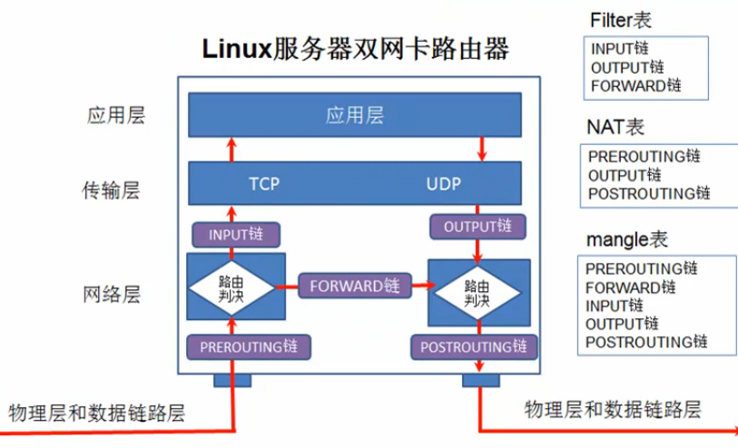
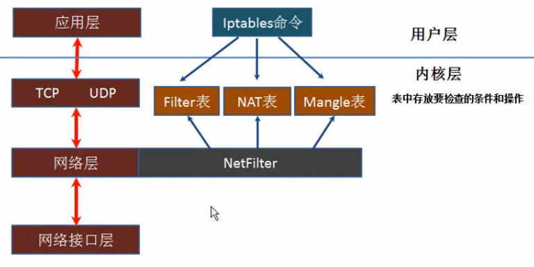
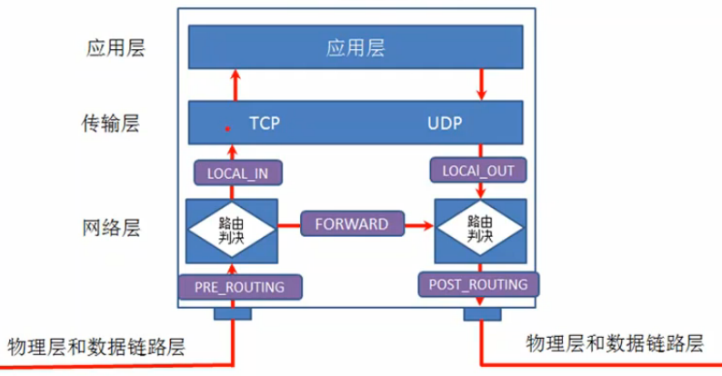
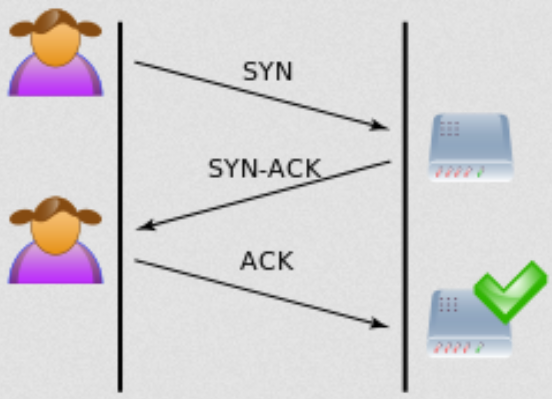
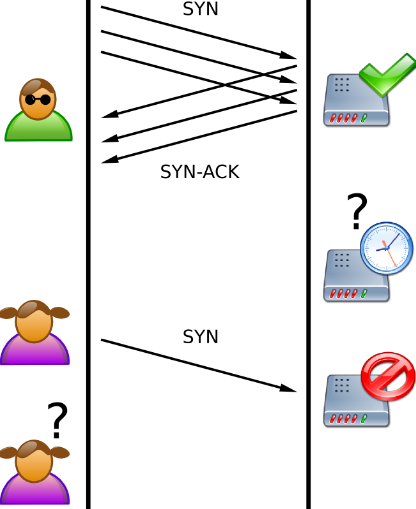

#### **iptables 常用的表和链**



* 命令：`iptables -t [指定表] -A [指定链] [规则...] -j [动作]`
  * `-A`： 附加规则到所选链的末尾
  * `-I`： 插入规则作所给定的规则编号
  * `-D`： 从所选链中删除一个或多个规则
  * `-R`： 替换所选链中一个或多个规则
  * `-P`： 定义默认策略（DROP/ACCEPT）
* 匹配：
  * `-i`：指定接收数据包的网络接口
  * `-o`：指定输出数据包的接口
  * `-p`：指定协议（tcp udp icmp vrrp all ...）
  * `-s`：包的源地址
  * `-d`：包的目的地址
  * `--sport`：指定源端口（范围：起始端口:结束端口）
  * `--dport`：指定目标端口（范围：起始端口:结束端口）
* 动作：
  * `ACCEPT`：将封包放行，进行完此处理动作，将不匹配下一条规则
  * `REJECT`：丢弃数据包，返回拒绝的消息
  * `DROP`：丢弃数据包，并且是不返回消息
  * `LOG`：将封包的处理信息记录日志中
* 例如：
  * 更改 FORWARD 链默认策略为 DROP：`iptables -t filter -P FORWARD DROP`
  * 禁止 ping：
    * `iptables -t filter -I INPUT -p icmp -j DROP`
    * `iptables -t filter -I INPUT -p icmp -i eth0 -j DROP`
    * `iptables -t filter -I INPUT -p icmp -s 192.168.0.0/16 -d 192.168.0.0/16 -i eth0 -j DROP`
  * 删除指定表和链的第 1 条规则：`iptables -t filter -D INPUT 1`
  * 插入规则到指定表和链的第 3 条：`iptables -t filter -I INPUT 3 -p icmp -j DROP`
  * 替换指定表和链的第 3 条：`iptables -t filter -R INPUT 3 -p icmp -j DROP`
  * 记录日志：
  * * 创建日志记录：`iptables -t filter -A INPUT -p icmp -j LOG`
    * 查看相关日志：`journalctl -kf | grep 'IN=.*OUT=.*'`
    * 可用 systemd-journal-gatewayd.service 分发管理日志

#### 扩展匹配：

* `-m state`**：基于状态检测包过滤**
  * 参数：
    * `--state NEW`：建立一个新会话的数据包
    * `--state ESTATBLISHED`：已经建立会话的数据
    * `--state INVALID`：非法的的数据包
    * `--state RELATED`：与之前定义的相关状态
  * 示例：
    * ftp 使用 21 端口，client 对 server 建立了一个新的会话 （NEW），server 使用 20 端口主动模式对 client 连接，如果允许了 RELATED 状态，那么第二个连接就能建立。还有就是client 能跟 server 建立会话，但 server 不能与 client 建立会话，例如 server 中了木马程序，可以保证 server 的安全性
    * `iptables -t filter -I OUTPUT -s 192.168.190.0/24 -m state --state NEW -j DROP`
* `-m icmp`**：ICMP 包高级过滤**
  * 参数：
    * `--icmp-type echo-request`：类型 8，发出的包
    * `--icmp-type echo-reply`：类型 0，返回的包
  * 示例：
    * 禁止 server 被 ping，server 能 ping 其他主机
    * `iptables -t filter -I INPUT -p icmp -m icmp --icmp-type [echo-request/8] -j DROP`
* `-m multiport`**：指定多个端口**
  * 参数：
    * `--sports`：指定数据包中多个源端口
    * `--dports`：指定数据包中多个目的端口
  * 示例：
    * 丢弃 1~21 和 80 端口的 tcp 的数据包
    * `iptables -t filter -I INPUT -p tcp -m multiport --dports 1:21,80 -j DROP`
* `-m iprange`**：指定 IP 范围**
  * 参数：
    * `--src-range [ ]`：指定数据包中多个源 IP 地址
    * `--dst-range [ ]`：指定数据包中多个源 IP 地址
  * 示例：
    * `-s 192.168.1.0/24`指的是一个网段，那么下面这个可以指定一个范围
    * `iptables -t filter -I INPUT -p icmp -m iprange --src-range 192.168.190.1-192.168.190.3 -j DROP`
* `-m connlimit`**：限制最大连接数**
  * 参数：
    * `--connlimit-above [ ]`：指定最大连接数
  * 示例：
    * server 的 eth0 网卡禁用 icmp 协议进入的限制最大连接数为 2
    * `iptables -t filter -I INPUT -p icmp -i eth0 -m connlimit --connlimit-above 2 -j DROP`
* `-m limit`**：限制某段时间内的封包流量**
  * 参数：
    * `--limit day [ ]`：根据 每天 限制某段时间内封包的平均流量
    * `--limit hour [ ]`：根据 每时 限制某段时间内封包的平均流量
    * `--limit second [ ]`：根据 每分 限制某段时间内封包的平均流量
    * `--limit minute [ ]`：根据 每表 限制某段时间内封包的平均流量
    * `--limit-burst [ ]`：限制同一时刻涌入数据包的数量
  * 示例：
    * 根据源地址限制其进入 server 每分钟平均进入的数据包不能超过 200 个，瞬间不能超过 500 个
    * `iptables -t filter -I INPUT -s [ ] -m limit --limit 200/second --limit-burst 500 -j ACCEPT`
    * `iptables -t filter -A INPUT -s [ ] -j DROP`
* `-m mac`**：匹配封包源 MAC**
  * 参数：
    * `--mac-source [ ]`：指定数据包中的源 MAC 地址
  * 示例：
    * 不能用于 OUTPUT 和 POSTROUTING 链中，因为封包要送出网卡后，才能由网卡驱动程序透过 ARP 协议查出目的 MAC 地址，所以 iptables 在进行封包比对时，并不知道封包会送到哪个网络接口去
    * Host A 在互联网发包给 Host B，其中封包在网络要经过多个路由器和交换机，每经过一个网络设备，其封包中的源 MAC 地址和目的 MAC 地址将被改变
    * `iptables -t filter -A INPUT -p icmp -m mac --mac-source 0a:00:27:00:00:00 -j DROP`
* `-m recent`**：限制某段时间内的封包数量**
  * 参数
    * `--name [ ]`：设定列表名称，默认为 DEFAULT
    * `--rsource [ ]`：源地址
    * `--rdest [ ]`：目的地址
    * `--seconds [ ]`：指定时间内
    * `--hitcount [ ]`：命中次数
    * `--set [ ]`：将地址添加进列表，并更新信息，包含地址加入时间戳
    * `--rcheck [ ]`：检查地址是否在列表，以第一个匹配开始计算时间
    * `--update [ ]`：检查地址是否在列表，以最后一个匹配开始计算时间
    * `--remove [ ] [ ]`：在列表里删除相应的地址，后跟列表名称及地址
  * 示例：
    * 限制 60 秒内只能建立 2 次 icmp 连接，已经建立连接会话的包允许通过
    * `iptables -t filter -A INPUT -p icmp -m state --state NEW -m recent --rcheck --seconds 60 --hitcount 2 -j DROP`
    * `iptables -t filter -A INPUT -p icmp -m state --state NEW -m recent --set -j ACCEPT`
    * `iptables -t filter -A INPUT -m state --state ESTABLISHED -j ACCEPT`
    * 防范 CC 攻击和非伪造 IP 的 syn flood

> `iptables -t filter -Z`：清空 iptables 的计数器

---

#### NetFilter 框架



* 用户空间
  * nginx , vsftpd , libvirtd , shhd ...
* 内核空间
  * TCP/IP , UDP , ICMP , ARP ...
* 包的流向
  * 网络接口 &gt; 网络层 &gt; NetFilter &gt; 传输层 &gt; 应用层 &gt; 传输层 &gt; NetFilter &gt; 网络层 &gt; 网络接口
  * （网络层与 NetFilter 是经过 kernel 中的钩子函数通信）
  * （包的出入都需经过 Netfilter 来过滤）

---

**对应的钩子：**



---

#### 防范 CC 攻击和非伪造 IP 的 syn flood

**CC** 攻击针对 web 服务器，攻击的数据包都是有效的数据包，无法拒绝服务，被攻击后 web 资源不能访问，其他正常

**syn flood** 或称SYN洪水，client 与 server 间创建 TCP 连接时，正常情况下 client 与 server 交换一系列的信息如下：



server 被攻击的过程：



在软防 iptables 方面做防范

限制 tcp 80 端口 60 秒内每个 ip 只能发起 10 个新连接，已建立的连接不断开，并记录在日志中：

```
iptables -t filter -A INPUT -p tcp --dport 80 --syn -m recent --name webpool --rcheck --seconds 60 --hitcount 10 -j LOG --log-prefix 'DDOS:' --log-ip-options
iptables -t filter -A INPUT -p tcp --dport 80 --syn -m recent --name webpool --rcheck --seconds 60 --hitcount 10 -j DROP
iptables -t filter -A INPUT -p tcp --dport 80 --syn -m recent --name webpool --set -j ACCEPT
iptables -t filter -A INPUT -p tcp --dport 80 -m state --state ESTABLISHED -j ACCEPT
iptables -t filter -A INPUT -p tcp --dport 80 -j DROP
```

注意添加 ssh 端口，（当前 ssh 的连接不会断开）

```
iptables -t filter -A INPUT -p tcp --dport 22 -j ACCEPT
```

systemd 查看日志

```
journalctl -kf | grep 'DDOS'
```

> [什么是CC攻击？](http://www.guance.com/577.html)
>
> [SYN flood是攻击详情](https://zh.wikipedia.org/wiki/SYN_flood)

---

#### 开启端口的钥匙

server 放在互联网上，对所有的机器开放 ssh 端口，这不太安全，所以使用 ping 指定特定的数据包大小作为开启 ssh 的钥匙，需要 ssh 时使用钥匙开启，那么 server 就对 icmp 的源地址的主机开启 ssh 端口，管理完毕再发个指定 ping 包的大小来关闭对 icmp 源地址开启的 ssh 端口，从而提高安全性，当然可以应用与跳板机，也可以指定 ping 包的源地址，为他人开启连接，而不用告知钥匙

* ssh 监听的端口为：24
* 检查时间 秒：2
* 开启端口 ping 包的大小字节 ：2200
* 关闭端口 ping 包的大小字节 ：2201
* 在 recent 模块记录到缓存表的表名：sshopen
* iptables 日志头部：sshopen

```
iptables -A INPUT -p tcp --dport 22 -j ACCEPT
1: iptables -t filter -A INPUT -p icmp --icmp-type echo-request -m length --length 2200 -j LOG --log-prefix 'sshopen:'
2: iptables -t filter -A INPUT -p icmp --icmp-type echo-request -m length --length 2200 -m recent --set --name sshopen --rsource -j ACCEPT
3: iptables -t filter -A INPUT -p tcp --dport 24 --syn -m recent --rcheck --seconds 2 --name sshopen --rsource -j ACCEPT
4: iptables -t filter -A INPUT -p icmp --icmp-type echo-request -m length --length 2201 -m recent --name sshopen --remove -j ACCEPT
5: iptables -t filter -A INPUT -m state --state NEW -j ACCEPT
iptables -A INPUT -j DROP
```

1. 记录 server 收到 ping 包大小等于  2200 的信息到日志
2. 只允许 server 收到 ping 包大小等于  2200，则记录包的源地址，client ip 到一个名为 sshopen 的临时表中
3. 检查 sshopen 表是否包含 ip，则向此 ip 开放 24 端口，并允许新建连接，2 秒过后阻止任何在 24 端口新建连接的请求
4. 需要在 2 秒钟内关闭允许新建 24 端口连接就发送 ping 包大小等于 2201 到 server
5. 默认情况下禁止任何主机与 server 在 24 端口建立会话

> ping 包的大小是：指定大小加上 IP 头部 20bit 和 ICMP 头部 8bit
>
> 查看日志指令：`journalctl -kf | grep 'sshopen'`

---

#### 本机端口映射

将本机所有在 80 端口 eth0 网卡接收到的 tcp 包目标地址为 192.168.1.290 作为端口转发给 192.168.1.199  端口 8080

不同网段之间做端口转发必须添加路由

```
# iptables -t nat -A PREROUTING -i eth0 -d 192.168.1.190 -p tcp --dport 80 -j DNAT --to 192.168.1.199:8080
```

本机端口映射

localhost 不经过 PREROUTING，也不是外部产生的包，因此需要用 OUTPUT

```
# iptables -t nat -A OUTPUT -d 127.0.0.1/24 -p tcp --dport 80 -j REDIRECT --to-ports
```

---

### 实现 NAT

* #### SNAT：源地址转换

  * 目标地址不变，重新改写源地址
  * 用于解决内网用户用一个公网地址
  * 如：
  * ```
    # 内网 192.168.1.0/24 通过一个公网 10.0.0.1 出口
    # iptables -t nat -A POSTROUTING -s 192.168.1.0/24  -j SNAT --to-source 10.0.0.1

    # 内网 192.168.1.0/24 通过一个公网网卡 eth1 出口
    # iptables -t nat -A POSTROUTING -s 192.168.1.0/24 -o eth1 -j MASQUEREADE
    ```
* #### DNAT：目标地址转换

  * 源地址不变，重新改写目标地址
  * 用于隐藏后端服务器的真实地址/端口转发
  * 如：
  * ```
    # 将请求IP为10.0.0.1的数据包转发到后端172.16.93.1主机上
    # iptables -t nat -A PREROUTING -d 10.0.0.1 -j DNAT –-to-destination 172.16.93.1

    # 将请求IP为10.0.0.1并且端口为80的数据包转发到后端的172.16.93.1端口为80主机上，实现端口转发
    # iptables -t nat -A PREROUTING -d 10.0.0.1 -p tcp –-dport 80 -j DNAT –-to-destination 172.16.93.1:8080
    ```

#### 软路由

两个网络之间可以互相转发

```
# echo 'net.ipv4.conf.default.forwarding = 1' >>/etc/sysctl.conf
# sysctl -p /etc/sysctl.conf

[or]

# echo '1' > /proc/sys/net/ipv4/ip_forward
```

```
# enp0s3: 192.168.100.133/24
# enp0s8: 192.168.1.1/24

# iptables -t nat -A POSTROUTING -s 192.168.100.0/24 -d 192.168.1.0/24 -o enp0s8 -j MASQUERADE
# iptables -t nat -A POSTROUTING -s 192.168.1.0/24 -d 192.168.100.0/24 -o enp0s3 -j MASQUERADE
```

> 参见
>
> ```
> http://dengyongrui.com/2017/05/22/linux_pei_zhi_lu_you_zhuan_fa_tong_guo_liang_ge_wang_kou_shi_xian_bu_tong_wang_duan_de_lu_you_zhuan/
> http://blog.51cto.com/lustlost/943110
> ```

---


### 生产环境单机规则

```shell
# clean
sudo ip6tables -P INPUT ACCEPT
sudo ip6tables -F
sudo ip6tables -A INPUT -j DROP
sudo ip6tables -P INPUT ACCEPT
sudo iptables -F

# internal
sudo iptables -A INPUT -s 127.0.0.1 -d 127.0.0.1 -j ACCEPT
sudo iptables -A INPUT -s 10.0.0.0/8     -j ACCEPT
sudo iptables -A INPUT -s 192.168.0.0/16 -j ACCEPT

# ssh
sudo iptables -A INPUT -p tcp --dport 22 -j ACCEPT

# icmp
sudo iptables -A INPUT -p icmp -m limit --limit 1/sec --limit-burst 10 -j ACCEPT

# http
sudo iptables -A INPUT -p tcp --dport 80 -j ACCEPT

# reject
sudo iptables -A INPUT -m state --state NEW -j REJECT

# slave
sudo service iptables  save
sudo service ip6tables save
sudo systemctl enable iptables
sudo systemctl enable ip6tables
```

配置文件

```shell
[root@centos]$ sudo cat /etc/sysconfig/iptables
```


---


### 客户端单机实例

```shell
# flush
iptables  -P INPUT ACCEPT
ip6tables -P INPUT ACCEPT
iptables  -F
ip6tables -F
iptables  -X
ip6tables -X
# localhost
iptables -A INPUT -i lo -s 127.0.0.1/32 -d 127.0.0.1/32 -j ACCEPT
iptables -A INPUT -i lo -j REJECT
ip6tables -A INPUT -i lo -s ::1/128 -d ::1/128 -j ACCEPT
ip6tables -A INPUT -i lo -j REJECT
# network
iptables -A INPUT -p icmp -m icmp --icmp-type echo-request -j ACCEPT
iptables -A INPUT -p tcp -m multiport --dports 80,443 -j ACCEPT
iptables -A INPUT -m state --state NEW -j REJECT
ip6tables -A INPUT -m state --state NEW -j REJECT
```

