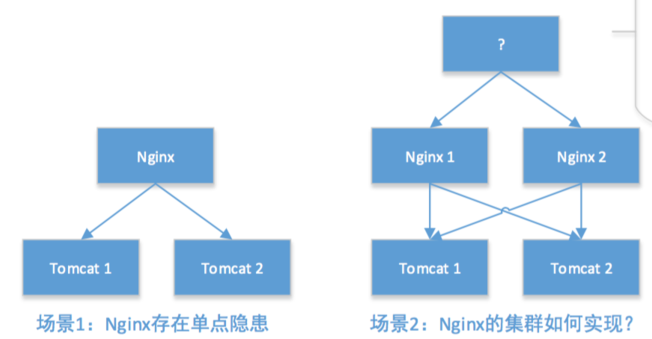
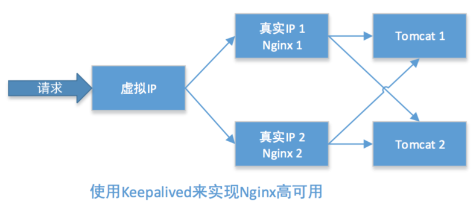

## 环境

* 抢占模式和非抢占模式
  * 抢占模式即 MASTER 从故障中恢复后，会将 VIP 从 BACKUP 节点中抢占过来
  * 非抢占模式即 MASTER 恢复后不抢占 BACKUP 升级为 MASTER 后的 VIP

```shell
yum install keepalived
```


## 抢占模式

* nginx 1
  * IP：192.168.6.4
    * VIP
      * 192.168.6.254
      * 192.168.6.253
* nginx 2
  * IP：192.168.6.5
    * VIP
      * 192.168.6.254
      * 192.168.6.253

### nginx 1

MASTER 机

配置 keepalived.conf

```
vrrp_script chk_script {
    script "commands"                            # 脚本退出值为 0 不匹配，为 1 则匹配
    interval 1                                   # 检测时间间隔 1 秒
}

vrrp_instance VI_1 {
    state MASTER                                 # 状态 MASTER BACKUP
    interface eth2                               # 选举通告从哪个网卡接口通信
    virtual_router_id 2                          # 虚拟路由的 ID，两个节点设置必须一样
    advert_int 1                                 # 检查间隔为 1 秒
    priority 200                                 # 初始权重，值越大，权重越高，值范围 0-254
    authentication {                             # 验证信息，两个节点必须一致
        auth_type PASS
        auth_pass 1111
    }
    track_script {                               # 存活状态检测脚本
        chk_script
    }
    virtual_ipaddress {                          # 对外的虚拟 IP（可多个），两个节点必须一样
        192.168.1.253/24
#       192.168.1.253/24 dev eth1                # VIP 绑定的网卡        
    }
# notify_master "/etc/keepalived/master.sh"      # 切换为 主时 执行的脚本
# notify_backup "/etc/keepalived/backup.sh"      # 切换为 从时 执行的脚本
# notify_fault  "/etc/keepalived/fault.sh"       # 切换为 故障 时执行的脚本
# notify_stop   "/etc/keepalived/stop.sh"        # keepalived 关闭执行的脚本
}
```

### nginx 2

BACKUP 机

配置 keepalived.conf

```
vrrp_script chk_script {
        script "/etc/keepalived/check.sh"
        interval 1
}

vrrp_instance VI_1 {
        state BACKUP
        interface eth2
        virtual_router_id 2
        advert_int 1
        priority 100
        authentication { 
                auth_type PASS
                auth_pass 1111
        }
        track_script { 
                chk_script
        }
        virtual_ipaddress { 
                192.168.1.253/24
        }
}
```

#### 状态检查 命令/脚本

##### /etc/keepalived/check.sh（nginx1 nginx2）

```
#!/usr/bin/env bash

if [[ $(timeout 2 curl -s 'http://127.0.0.1/phpfpm_ping') = 'F98EA8FE223C713B' ]]; then
    exit 0
else
    sleep 10s
    if [[ $(timeout 2 curl -s 'http://127.0.0.1/phpfpm_ping') = 'F98EA8FE223C713B' ]]; then
        exit 0
    else
        exit 1
    fi
fi
```

或者mysql 的检查脚本

```
#!/usr/bin/env bash

host='127.0.0.1'
port='3306'
user='user'
pass='passwd'

/usr/bin/timeout 1 /usr/bin/mysql -u $user -p"$pass" -h $host -P $port -e 'SHOW STATUS' >/dev/null 2>&1 ; one=$?

if [[ $one = '0' ]]; then
    exit 0
else
    /usr/bin/timeout 1 /usr/bin/mysql -u $user -p"$pass" -h $host -P $port -e 'SHOW STATUS' >/dev/null 2>&1 ; one=$?
    sleep 10s
    if [[ $one != '0' ]] && [[ $two != '0' ]]; then
        exit 1
    else
        exit 0
    fi
fi
```

redis 检查脚本

```
#!/usr/bin/env bash

host='127.0.0.1'
port='6379'
/usr/bin/timeout 1 /usr/local/bin/redis-cli -h $host -p $port info >/dev/null 2>&1 ; one=$?

if [[ $one = '0' ]]; then
    exit 0
else
    /usr/bin/timeout 1 /usr/local/bin/redis-cli -h $host -p $port info >/dev/null 2>&1 ; two=$?
    sleep 10s
    if [[ $one != '0' ]] && [[ $two != '0' ]]; then
        exit 1
    else
        exit 0
    fi
fi
```

haproxy 检查脚本

```
#!/usr/bin/env bash

if [[ $(timeout 2 curl -s 'http://127.0.0.1/phpfpm_ping') = 'F98EA8FE223C713B' ]]; then
    echo 0
        exit 0
else
    echo 1
        exit 1
fi
```

授权执行权限

```
chmod u+x /etc/keepalived/nginx_check.sh
```

开启服务

```
service keepalived start
chkconfig keepalived on
```

---


## 非抢占模式

1. `state` 都设置为 BACKUP
2. 添加 `nopreempt` 选项


> [http://www.jianshu.com/p/da26df4f7d60](http://www.jianshu.com/p/da26df4f7d60)  
> [https://my.oschina.net/xshuai/blog/917097](https://my.oschina.net/xshuai/blog/917097)  
> [http://blog.csdn.net/xyang81/article/details/52556886](http://blog.csdn.net/xyang81/article/details/52556886)


