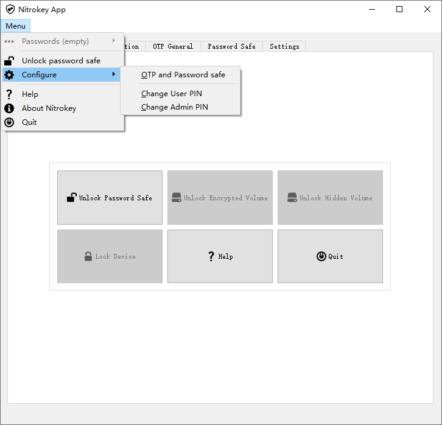
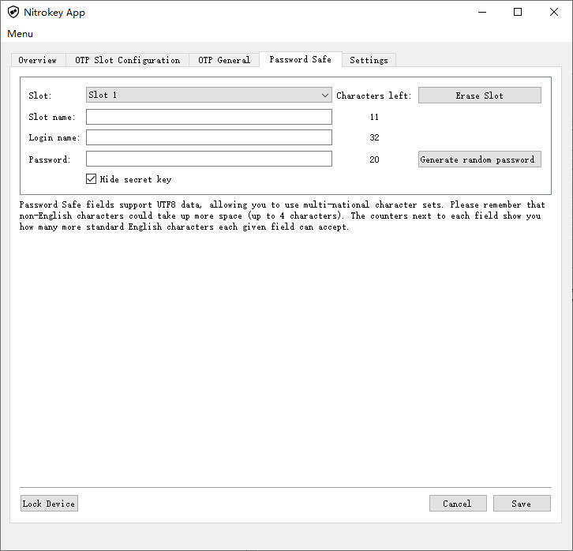

## Nitrokey 硬件智能卡


##### 更改默认密码  <span style="color:red;">必须</span>

1. 下载 [Nitrokey App](https://www.nitrokey.com/download)
2. 更改管理PIN码和用户PIN码
   

说明

* 默认 User PIN 是 **123456**
* 默认 Admin PIN 是 **12345678**
* User PIN 只有 **3** 次机会，否则需要使用 Admin PIN 来解锁
* Admin PIN 也只有 **3** 次机会，否则只能 [重置 key](https://www.nitrokey.com/documentation/frequently-asked-questions-faq#how-to-reset-a-nitrokey)


##### 存储密码字符串




---


## GPG


##### 历史

1. PGP 是一个基于 RSA、AES 算法实现，PGP本身是商业应用程序
2. OpenPGP 是一项开放互联网标准，任何支持这一标准的程序也被允许称作 OpenPGP
3. GnuPG/GPG 是GNU 组织遵循 OpenPGP 技术标准设计，并与 OpenPGP 兼容


##### 说明

在 GPG 中，有主钥和子钥的概念，主钥和子钥都可以指定不同的用途

当使用默认参数生成一对密钥的时候，首先会生成一个主密钥，这个主密钥默认拥有 签名[S]和认证[C] 的用途

同时还会生成一个子密钥，这个子密钥默认用途只有加密[E]

当主密钥对子密钥认证[C]之后，这个子密钥就和主密钥”绑定”在了一起

因此日常的加密和签名操作是更推荐使用子密钥来进行，而主密钥一般情况下不使用


##### 功能

| 简写 | 能力（Capability）/用途（Usage） | 说明                                                 |
| :--: | -------------------------------- | ---------------------------------------------------- |
| [C]  | Certificating                    | 认证其他密钥/给其他证书签名，就像SSL/TLS的根证书一样 |
| [S]  | Signing                          | 签名，比如给文件添加数字签名，给邮件签名，给git签名  |
| [A]  | Authenticating                   | 身份验证/鉴权，比如SSH登陆                           |
| [E]  | Encrypting                       | 加密，比如加密文件、消息                             |


---


## GnuPG 常用命令

* 必用程序 `apt-get install gnupg2 scdaemon pcscd dirmngr`
* 如果 `~/.gnupg/` 清空过，则需要运行 `gpgconf --kill gpg-agent`


##### 查看智能卡内容

```text
user@test:~$ gpg --card-status

Reader ...........: Key Name (000000000000000000000000) 00 00
Application ID ...: 00000000000000000000000000000000
Version ..........: 0
Manufacturer .....: Name
Serial number ....: 00000000
Name of cardholder: [not set]
Language prefs ...: en
Sex ..............: unspecified
URL of public key : [not set]
Login data .......: [not set]
Signature PIN ....: not forced
Key attributes ...: rsa4096 rsa4096 rsa4096
Max. PIN lengths .: 0 0 0
PIN retry counter : 0 0 0
Signature counter : 0
Signature key ....: 0000 0000 0000 0000 0000  0000 0000 0000 0000 0000
      created ....: 2020-00-00 00:00:00
Encryption key....: 0000 0000 0000 0000 0000  0000 0000 0000 0000 0000
      created ....: 2020-00-00 00:00:00
Authentication key: 0000 0000 0000 0000 0000  0000 0000 0000 0000 0000
      created ....: 2020-00-00 00:00:00
General key info..: pub  rsa4096/0000000000000000 2020-00-00 RealName (Comment) <EmailAddress>
sec>  rsa4096/0000000000000000  created: 2020-00-00  expires: never     
                                card-no: 0000 00000000
ssb>  rsa4096/0000000000000000  created: 2020-00-00  expires: never     
                                card-no: 0000 00000000
ssb>  rsa4096/0000000000000000  created: 2020-00-00  expires: never     
                                card-no: 0000 00000000
```


##### 删除智能卡所有数据

```text
user@test:~$ gpg --card-edit

gpg/card> admin
Admin commands are allowed

gpg/card> factory-reset
gpg: OpenPGP card no. D0000000000000000000000000000000 detected

gpg: Note: This command destroys all keys stored on the card!

Continue? (y/N) y
Really do a factory reset? (enter "yes") yes
```


##### 在智能卡上生成私钥

```text
user@test:~$ gpg --card-edit

gpg/card> admin
Admin commands are allowed

gpg/card> generate
Make off-card backup of encryption key? (Y/n) n  ## 这里选择是不备份私钥到计算机 ##
        ┌──────────────────────────────────────────────┐
        │ Please enter the PIN                         │
        │                                              │
        │ PIN ********________________________________ │
        │                                              │
        │      <OK>                        <Cancel>    │
        └──────────────────────────────────────────────┘
What keysize do you want for the Signature key? (4096) 4096       ## 推荐使用这个长度 ##
What keysize do you want for the Encryption key? (4096) 4096      ## 推荐使用这个长度 ##
What keysize do you want for the Authentication key? (4096) 4096  ## 推荐使用这个长度 ##
Please specify how long the key should be valid.
         0 = key does not expire
      <n>  = key expires in n days
      <n>w = key expires in n weeks
      <n>m = key expires in n months
      <n>y = key expires in n years
Key is valid for? (0) 0  ## 私钥永不过期 ##
Key does not expire at all
Is this correct? (y/N) y

GnuPG needs to construct a user ID to identify your key.

Real name: ## 推荐填写名字 ##
Email address:  ## 推荐填写邮箱 ##
Comment:  ## 推荐填写备注 ##
You selected this USER-ID:
    "Real name (Comment) <Email address>"

Change (N)ame, (C)omment, (E)mail or (O)kay/(Q)uit? o
        ┌────────────────────────────────────────────────────┐
        │ Please enter the Admin PIN                         │
        │                                                    │
        │ Admin PIN **********______________________________ │
        │                                                    │
        │       <OK>                            <Cancel>     │
        └────────────────────────────────────────────────────┘
gpg: /home/user/.gnupg/trustdb.gpg: trustdb created
gpg: key 1000000000000000 marked as ultimately trusted
gpg: directory '/home/user/.gnupg/openpgp-revocs.d' created
gpg: revocation certificate stored as '/home/user/.gnupg/openpgp-revocs.d/4000000000000000000000000000000000000000.rev'
public and secret key created and signed.
```


##### 导出智能卡公钥

```
gpg --armor --export <pub id>
```


##### 上传gpg公钥到github

1. 登陆 [github.com](https://github.com)
2. 进入 Settings -> SSH and GPG keys -> New GPG key
3. 粘贴gpg公钥字符串并提交
4. 公钥地址就是 `https://github.com/<用户名>.gpg`


##### 智能卡指定公钥url

```text
user@test:~$ gpg --card-edit

gpg/card> admin
Admin commands are allowed

gpg/card> url
URL to retrieve public key: <http://>

```


##### 从github上恢复公钥

```
user@test:~$ gpg --card-edit

gpg/card> fetch
gpg: requesting key from 'https://'
gpg: key 0000000000000000: "Real name (Comment) <Email address>" changed
gpg: Total number processed: 1
gpg:              unchanged: 1
```


---


## GnuPG解锁LUKS根分区

* 清除密钥槽 `cryptsetup luksErase -q /dev/sda3`

> 参考 <https://wiki.majic.rs/Openpgp/protecting_luks_decryption_key_in_debian_jessie_us/>


#### 一、设置GnuPG密钥环

* 存储密钥环的目录

```shell
[[ ! -d "/etc/luks_gnupg" ]] && mkdir "/etc/luks_gnupg" && chmod 0700 "/etc/luks_gnupg"
```

* 初始化密钥环

```shell
# 使用gpg智能卡密钥环则先获取公钥
gpg --homedir "/etc/luks_gnupg" --card-edit
gpg> fetch

# 使用本地密钥环则新建密钥环
gpg --homedir "/etc/luks_gnupg" --full-generate-key
```

* 安装PIN输入应用程序

```shell
apt-get install pinentry-curses
```

* 配置GnuPG代理

```shell
echo "pinentry-program /usr/bin/pinentry-curses" >/etc/luks_gnupg/gpg-agent.conf
```

* 减少混乱的日志输出

```shell
echo "log-file /dev/null" >/etc/luks_gnupg/scdaemon.conf
```


#### 二、为LUKS设置新的解密密钥

* 生成256位随机密钥

```shell
dd if=/dev/random bs=1 count=256 of="/etc/luks_gnupg/disk.key"
```

* 将密钥添加到加密分区

```shell
cryptsetup luksAddKey "/dev/sda3" "/etc/luks_gnupg/disk.key"
```

* 使用GnuPG私钥加密LUKS密钥

```shell
gpg --homedir "/etc/luks_gnupg" --recipient <pub id> --encrypt-files "/etc/luks_gnupg/disk.key"
```

* 安全删除明文的LUKS密钥

```shell
shred -u "/etc/luks_gnupg/disk.key"
```


#### 三、设置解密脚本

* 创建用于获取明文LUKS密钥的脚本

```shell
#!/bin/sh

# /usr/local/sbin/luks_gnupg_decrypt.sh
# This is the safest way to ensure the GnuPG home directory is correctly set.
export GNUPGHOME=/etc/luks_gnupg/

gpg2 --no-tty --decrypt /etc/luks_gnupg/disk.key.gpg
```

* 给予对应权限

```shell
chown root:root "/usr/local/sbin/luks_gnupg_decrypt.sh"
chmod 0750 "/usr/local/sbin/luks_gnupg_decrypt.sh"
```

* 测试LUKS加密分区的解密

```shell
/usr/local/sbin/luks_gnupg_decrypt.sh |cryptsetup open --test-passphrase "/dev/sda3" test --key-file=-
```


#### 四、准备initramdisk

* 追加配置到 `/etc/crypttab`

```shell
,keyscript=/usr/local/sbin/luks_gnupg_decrypt.sh
```

* 创建initramdisk以确保所需的二进制文件、GnuPG密钥环、解密脚本 都包含在镜像中

```shell
#!/bin/sh

# /etc/initramfs-tools/hooks/luks_gnupg

set -e

PREREQ="cryptroot"

prereqs()
{
        echo "$PREREQ"
}

case $1 in
prereqs)
        prereqs
        exit 0
        ;;
esac

. /usr/share/initramfs-tools/hook-functions

# Deploy the keyring.
cp -a /etc/luks_gnupg/ "${DESTDIR}/etc/"

# Deploy terminfo (required for pinentry-curses).
mkdir -p "${DESTDIR}/etc/terminfo/l/"
cp -a /lib/terminfo/l/linux "${DESTDIR}/etc/terminfo/l/linux"

# Deploy GnuPG binaries and pinentry-curses.
copy_exec /usr/bin/gpg2
copy_exec /usr/bin/gpg-agent
copy_exec /usr/bin/pinentry-curses
copy_exec /usr/lib/gnupg/scdaemon

exit 0
```

* 给予对应权限

```shell
chown root:root "/etc/initramfs-tools/hooks/luks_gnupg"
chmod 0750 "/etc/initramfs-tools/hooks/luks_gnupg"
```

* 更新initramdisk镜像

```shell
update-initramfs -u -k all
```


#### 五、完成

删除旧密码短语

```shell
cryptsetup luksRemoveKey /dev/sda3
```

重启


---


## LUKS密钥插槽

<span style="color:red;">警告</span>：不要将所有插槽都清空，这将意味着下次无法解锁


```shell
# 查看插槽
cryptsetup luksDump "/dev/sda3" |grep Slot

# 删除id为0的插槽
cryptsetup luksKillSlot "/dev/sda3" 0

# 添加密钥到插槽
cryptsetup luksAddKey "/dev/sda3" "/masterkeyfile.key"
```


如果所有所有插槽已经被清空，并且LUKS已经解锁，还能补救下

下面重新插入密码到插槽

```shell
# 显示系统上已安装的所有分区的加密密钥，从这获取aes-xts-plain64类似128个连续字符串
dmsetup table --showkeys

# 写入临时文件
vi "existinglukskey.txt"

# 创建二进制密钥文件
xxd -r -p "existinglukskey.txt" "existinglukskey.bin"

# 输入新密码短语就完成
cryptsetup luksAddKey "/dev/sda3" --master-key-file <(cat existinglukskey.bin)
```


或者也可以备份 Master Key，这个是恢复密钥

```shell
cryptsetup luksDump --dump-master-key /dev/sda3
```


---


## /boot 迁移到优盘

> apt-get install dosfstools


#### 一、格式化对应的分区

```shell
mkfs.vfat "/dev/sdb1"
mkfs.ext4 "/dev/sdb2"
```


#### 二、挂载新的启动分区

```shell
[[ ! -d "/mnt/new_boot" ]] && mkdir "/mnt/new_boot"
mount "/dev/sdb2" "/mnt/new_boot"
[[ ! -d "/mnt/new_boot/efi" ]] && mkdir "/mnt/new_boot/efi"
mount "/dev/sdb1" "/mnt/new_boot/efi"
```


#### 三、复制到新启动分区

```shell
cp -a /boot/* "/mnt/new_boot"
```


#### 四、确定新启动分区的UUID

```shell
blkid "/dev/sdb1"
blkid "/dev/sdb2"
```


#### 五、更新 `/etc/fstab` 中的 `/boot`

将旧的引导分区UUID替换为新的UUID


#### 六、卸载引导分区

```shell
umount "/mnt/new_boot/efi"
umount "/mnt/new_boot"
umount "/boot/efi"
umount "/boot"
```


#### 七、重新挂载启动分区

```shell
mount -a
```


#### 八、重新配置引导程序以使用USB闪存驱动器

```shell
dpkg-reconfigure grub-efi-amd64
```


#### 九、擦除旧的启动分区

```shell
dd if=/dev/urandom bs=16M of="/dev/sda1"
dd if=/dev/urandom bs=16M of="/dev/sda2"
```


