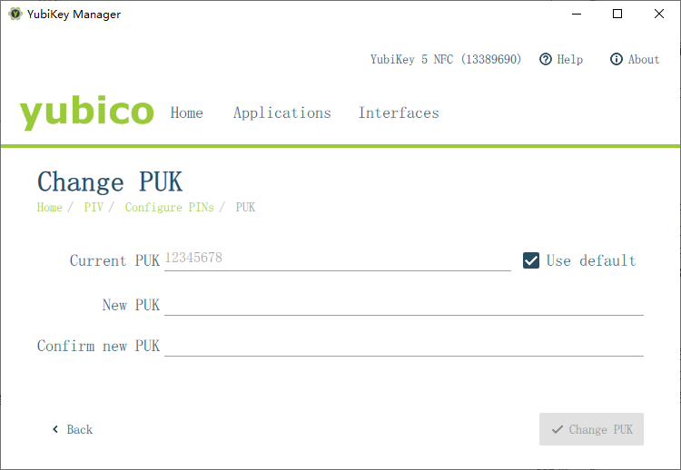
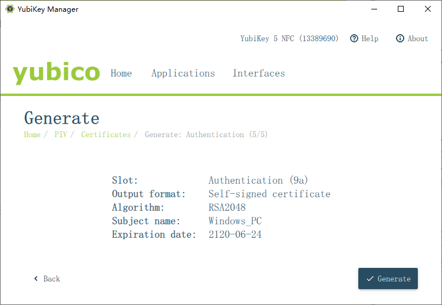
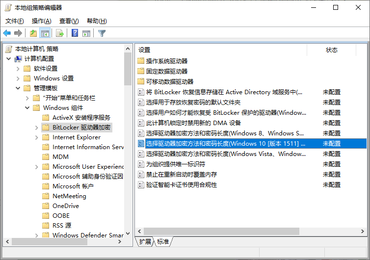
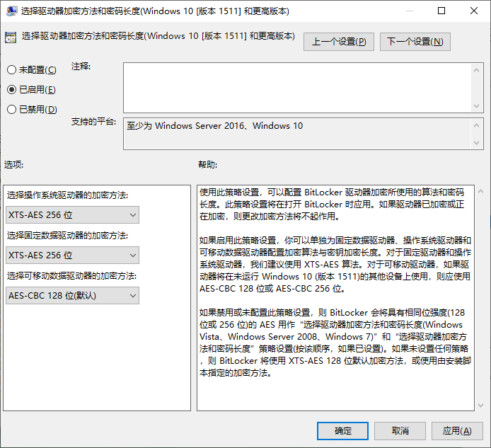
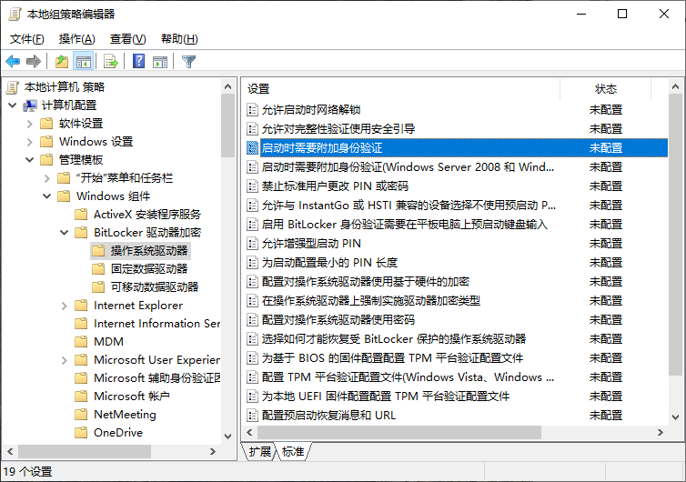
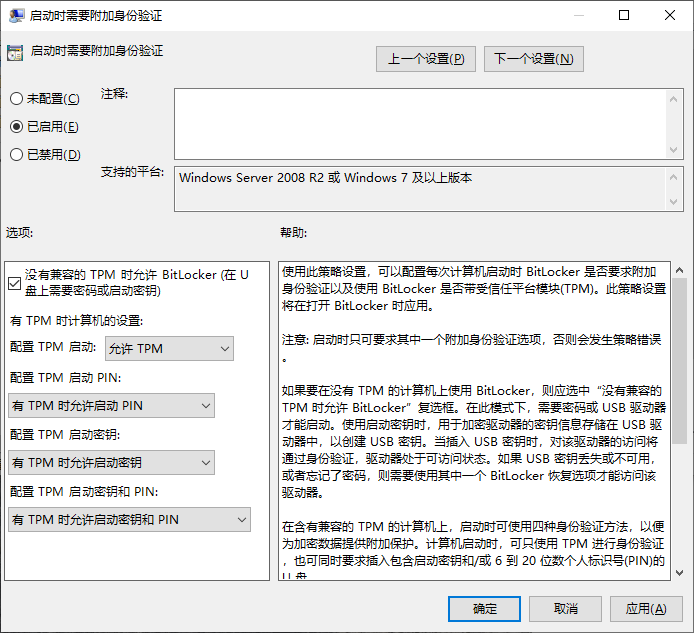

# Windows 计算机使用


## 磁盘加密


加密软件使用 BitLocker

* 微软自家产品，兼容性好


算法/强度

1. AES 128
2. AES 256


有四种方法解锁 BitLocker

1. 仅TPM
2. TPM+PIN
3. TPM+私钥
4. TPM+私钥+PIN

> 不要仅使用TPM，这样会使破坏者拥有此计算机的TPM芯片时就能解密数据
>
> 尽量不要只使用PIN，会增加暴力尝试破解的风险
>
> 如果使用公私钥方法，最好使用防篡改硬件智能卡，不要使用普通U盘


---


#### 防篡改硬件智能卡


优点

1. 私钥永远不能导出
2. 物理暴力无法获取私钥


设备选型

| Nitrokey | 开源硬件和自由软件 | 偏贵 | 额外特性偏少        |
| :------: | :----------------: | :--: | ------------------- |
| Yubikey  |   专利硬件和软件   | 便宜 | 支持 U2F/NFC/type-c |


使用方式

* 日常使用PIN验证身份
  * PIN通常有长度限制
  * 为了兼容性，PIN尽量只使用数字
  * 有很小的尝试次数，超过这个次数，将会锁定PIN
* 管理口令
  * 权限很大，甚至可以解锁或更改PIN
  * 通常没有尝试次数，所以尽量设置复杂，推荐 `[a-zA-z0-9]{10,20}`

> PIN可以设置简单，反正有次数限制
>
> 管理口令必须复杂，因为可以无限次尝试口令
>
> PIN可以忘记/记错，但是管理密码必须记住，否则数据肯定不能解密了
>
> 重置key可不用验证身份哦


---


#### Yubikey 配置

下载管理程序并安装 [YubiKey Manager | Yubico](https://www.yubico.com/products/services-software/download/yubikey-manager/)


1. 更改默认的管理口令
2. 更改默认的PIN
3. 生成RSA自签名证书（BitLocker不支持ECCP）


---


#### Windows10 配置


从Windows10开始，BitLocker默认不使用子签名证书，所以需要手动开启

* 保存为 `.reg` 文件并执行

```
Windows Registry Editor Version 5.00
 
[HKEY_LOCAL_MACHINE\SOFTWARE\Policies\Microsoft\FVE]
"SelfSignedCertificates"=dword:00000001
```


##### 更改加密强度

* BitLocker默认加密强度为AES128，可更改为AES256
* Win+R 运行 gpedit.msc（组策略）

1. 计算机配置 - 管理模板 - Windows组件 - BitLokcer 驱动器加密
2. 对于 系统盘和固定数据盘 使用XTS，可移动盘使用CBC，为了兼容


##### 启用高级验证选项

* BitLocker启用TPM+私钥+PIN的验证方式
* Win+R 运行 gpedit.msc（组策略）

1. 计算机配置 - 管理模板 - Windows组件 - BitLokcer 驱动器加密 - 操作系统驱动器
2. 启用就好，其他选项使用默认


##### 加密系统盘

* 如果有TPM，默认使用TPM
* 系统盘较为特殊不能使用智能卡，原因可查看页尾
* 推荐使用复杂的PIN；不推荐U盘是因为U盘不防病毒程序，病毒可以轻易获取私钥
* C盘右键 - 启用 BitLocker - 输入PIN


##### 加密数据盘

- 推荐使用防篡改硬件智能卡，优点在本文章的概述中
- C盘右键 - 启用 BitLocker - 插入智能卡


---


#### 日常解密

* 开机时需要输入系统盘的PIN（无限尝试次数）
* 数据盘要插入key，并输入PIN（有限尝试次数）


---


#### 参考

* [BitLocker 智能卡自签名证书 – Extrawdw](https://blog.extrawdw.net/computer/windows/bitlocker-smartcard-self-signed-certificates/)

* [Using Smart Cards with BitLocker | Microsoft Docs](https://docs.microsoft.com/en-us/previous-versions/windows/it-pro/windows-7/dd875530(v=ws.10))

* [什么是BitLocker驱动器加密？ | Study.com](https://study.com/academy/lesson/what-is-bitlocker-drive-encryption.html)

* [BitLocker为什么不支持预引导身份验证用于智能卡 | Microsoft Docs](https://docs.microsoft.com/en-us/windows/security/information-protection/bitlocker/bitlocker-using-with-other-programs-faq#can-bitlocker-support-smart-cards-for-pre-boot-authentication)


---


## Windows10 LTSC 问题小记录


#### 下载原版镜像

* 我上传S3的镜像

```
未公开
```

* 来自 msdn.itellyou.cn

```
ed2k://|file|cn_windows_10_enterprise_ltsc_2019_x64_dvd_9c09ff24.iso|4478906368|E7C526499308841A4A6D116C857DB669|/
```


---


#### 激活

cmd 运行下面命令

```cmd
slmgr -ipk 4P9W8-BN6PB-QGXH9-F6GWJ-PKCR9
slmgr -skms kms.03k.org
slmgr -ato
```


---


#### 安装 Microsoft Store

1. 浏览器打开 <https://aka.ms/diag_apps10> 下载修复程序
2. 按照提示登陆微软帐号
3. 点击修复


---


#### UAC 添加密码验证

* 保存为 `.reg` 文件并执行

```
Windows Registry Editor Version 5.00

[HKEY_LOCAL_MACHINE\SOFTWARE\Microsoft\Windows\CurrentVersion\Policies\System]
"ConsentPromptBehaviorAdmin"=dword:00000001
```


---


#### 安装 Edge 浏览器

因为LTSC版是不带edge浏览器，而且官网下载也麻烦，就上传了这个文件，每次用这个exe安装就好了。

* [下载安装程序](https://download.liuq.org/microsoft.com/MicrosoftEdgeSetup.exe)


---


#### Windows使用UTC作为时间（兼容linux）

* 保存为 `.reg` 文件并执行

```reg
Windows Registry Editor Version 5.00

[HKEY_LOCAL_MACHINE\SYSTEM\CurrentControlSet\Control\TimeZoneInformation]
 "RealTimeIsUniversal"=dword:00000001
```

