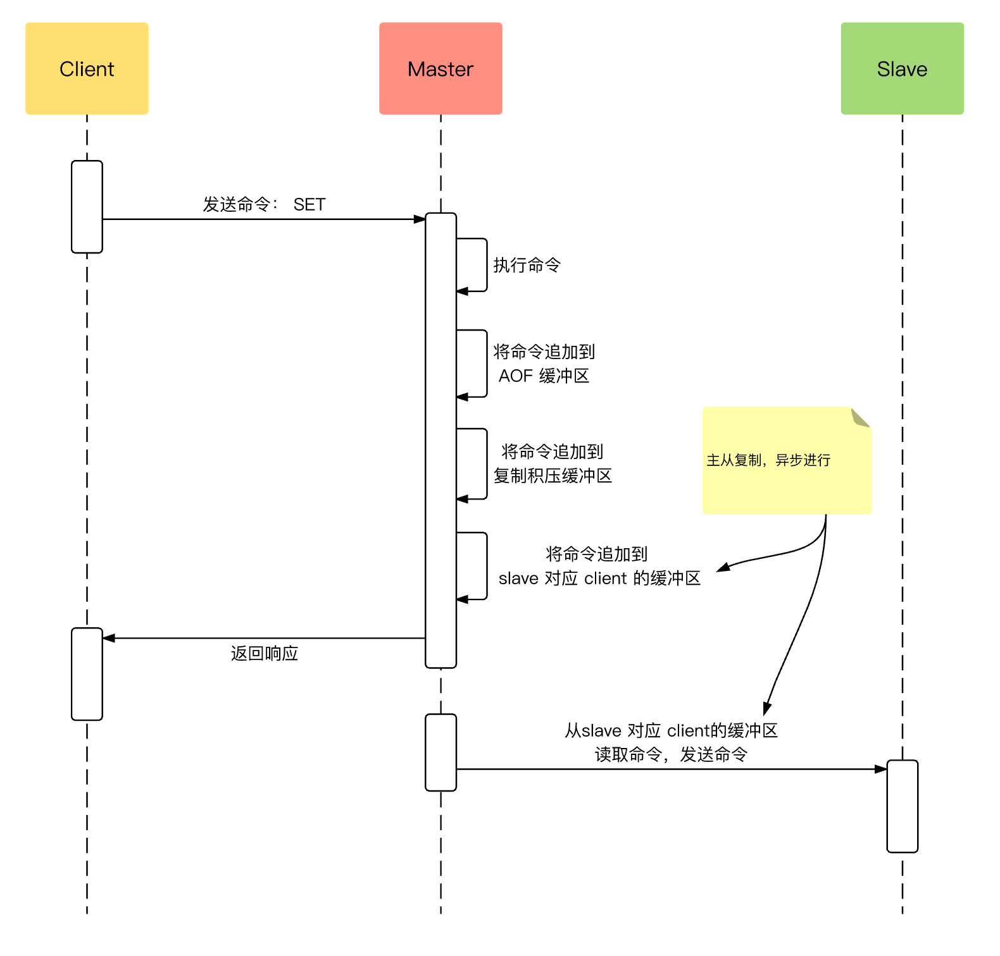
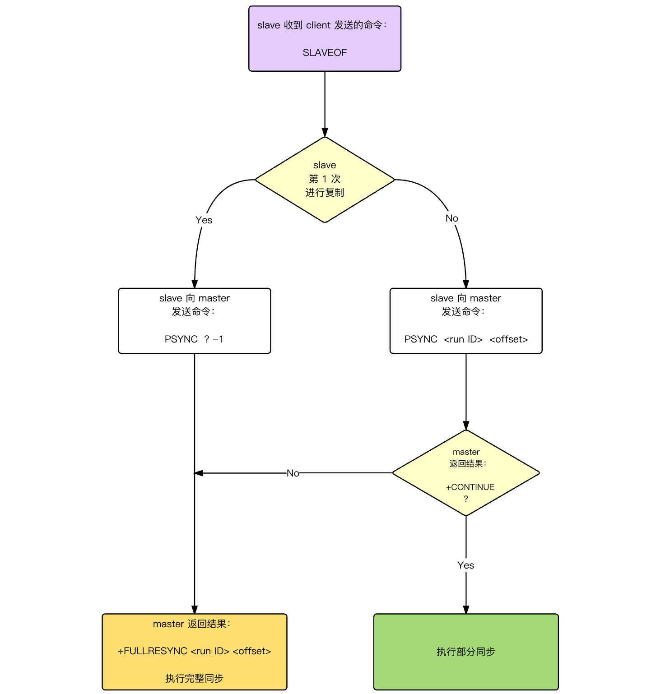
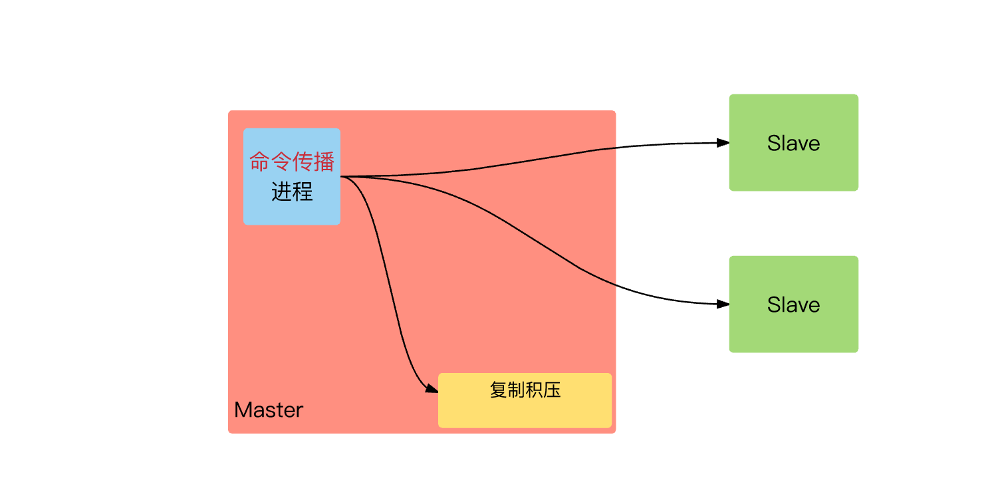

# 安装

```shell
yum localinstall -y "http://rpms.famillecollet.com/enterprise/remi-release-6.rpm"
yum --enablerepo="remi" install -y redis
# /etc/init.d/redis start
```


---


# 分析key大小


#### 粗略的分析

* 该命令使用scan方式对key进行统计，所以使用不会对redis造成阻塞

```shell
redis-cli -h <host> -p <port> --bigkeys
```

```
# Scanning the entire keyspace to find biggest keys as well as
# average sizes per key type.  You can use -i 0.1 to sleep 0.1 sec
# per 100 SCAN commands (not usually needed).

[00.00%] Biggest hash   found so far 's_9329222' with 3 fields
[01.90%] Biggest hash   found so far 'uno_facet_2018-12-20' with 59 fields
[27.05%] Biggest set    found so far 'blacklist_set_key' with 31832 members
[73.87%] Biggest string found so far 'PUSH_NEWS' with 3104237 bytes
[86.18%] Biggest zset   found so far 'region_hot_北京' with 2688 members

-------- summary -------

Sampled 4263 keys in the keyspace!
Total key length in bytes is 174847 (avg len 41.02)

Biggest string found 'PUSH_NEWS' has 3104237 bytes
Biggest    set found 'blacklist_set_key' has 31832 members
Biggest   hash found 'uno_facet_2018-12-20' has 59 fields
Biggest   zset found 'region_hot_北京' has 2688 members

1616 strings with 3771161 bytes (37.91% of keys, avg size 2333.64)
0 lists with 0 items (00.00% of keys, avg size 0.00)
1 sets with 31832 members (00.02% of keys, avg size 31832.00)
2353 hashs with 7792 fields (55.20% of keys, avg size 3.31)
293 zsets with 333670 members (06.87% of keys, avg size 1138.81)
```


#### 细化每个key大小

* 需要`python2.4`以上版本和`pip`

```shell
yum install python-pip
pip install rdbtools
```

```shell
rdb -c memory /path/redis.rdb >memory.csv
```

* 示例输出`csv`文件

```
database,type,key,size_in_bytes,encoding,num_elements,len_largest_element,expiry
0,hash,index_flow_yingshi,10492,hashtable,1,8992,2019-01-14T08:20:10.236000
0,hash,index_movie,22068,hashtable,7,2896,2019-01-14T07:29:19.685000
0,string,index_module_novel,8296,string,7694,7694,2019-01-13T00:27:46.128000
0,string,index_bottom_baike_aikan,8296,string,7632,7632,2019-01-14T02:27:11.850000
0,string,index_bottom_tools,5224,string,4549,4549,2019-01-13T01:02:09.171000
0,string,index_module_travel,7272,string,6408,6408,2019-01-13T00:43:39.478000
```

* 后面可使用`shell`脚本来分析


---


# 主从复制

异步进行，不影响主线程



PSYNC 同步命令



实现原理



#### 基本过程

1. slave 启用同步
   1. 或者配置文件写入同步相关配置信息
   2. client 向 slave 发送命令启用同步：SLAVEOF &lt;master\_ip&gt; &lt;master\_port&gt;
2. slave 在本地登记对应\(配置文件写入同步信息\) master 的 ip、port
3. slave 与 master 建立连接
4. slave 向 master 发送命令 PING，判断连接状态是否良好，否则重新建立连接
5. slave 向 master 发送命令 AUTH，进行身份认证
6. slave 向 master 发送命令 REPLCONF listening-port &lt;port-num&gt;，告知 master ，当前 slave 所在监听的端口号
   1. master 接收到 slave 信息后，将slave 监听的端口号记录到 redisClient 的 slave\_listening\_port 属性
   2. 其唯一作用：master 执行 INFO replication 命令时，打印出 slave 的监听端口
7. 检查是否需要同步，master 会判断 slave 传来的 运行ID（master run id） 是否与自己的相同
   1. 相同则表示之间同步过数据，现在不需要同步
   2. 不相同则表示之间没有同步过数据，现在需要同步
   3. 需要同步则 slave 向 master 发送命令 PSYNC
8. 判断需要同步数据选择 全量/增量
   1. master 判断最后同步成功命令的复制偏移量（replication offset）在积压队列缓存中，则执行增量同步  
   2. master 判断最后同步成功命令的复制偏移量（replication offset）不在积压队缓存列中，则执行全量同步

#### 概念

* 全量同步
  * master 执行持久化操作（写入 RDB 文件到磁盘或者 TCP套接字）
  * master 并将持久化期间收到的指令数据缓存起来
  * master 会将 RDB 和缓存的指令数据一同发送至 slave，slave 将加载收到的 RDB 和缓存的指令数据  
* 增量同步
  * master 向 slave 进行命令传播  其中，master、slave 互为对方的客户端
  * master 能够向 slave 传播命令，本质：master 为 slave 的客户端  
* 积压队列缓存（in-memory backlog）
  * master 进行命令传播时，会将命令发送给所有 slave，同时写入积压队列缓存（内存缓冲区）
  * 相关配置：
    * 大小 MB：repl-backlog-size
    * 存活时间 S：repl-backlog-ttl    
* slave 复制断线重连
  * master/slave 根据条目 7~8，执行复制

#### 避免数据丢失

当启用 Redis 复制功能时，强烈建议打开主服务器的持久化功能。否则的话，由于延迟等问题，部署的服务应该要避免使用类似 Supervisor 的服务自动启动 Redis 服务

参考以下会导致主从服务器数据全部丢失的危险性例子：

* 假设节点A为主服务器，并且关闭了持久化。 并且节点B和节点C从节点A复制数据
* 节点A崩溃，然后由自动拉起服务重启了节点A. 由于节点A的持久化被关闭了，所以重启之后没有任何数据
* 节点B和节点C将从节点A复制数据，但是A的数据是空的， 于是就把自身保存的数据副本删除

在关闭主服务器上的持久化，并同时开启自动启动进程的情况下，即便使用 Sentinel 来实现 Redis 的高可用性，也是非常危险的。 因为主服务器可能启动得非常快，以至于 Sentinel 在配置的心跳时间间隔内没有检测到主服务器已被重启，然后还是会执行上面的数据丢失的流程。

无论何时，数据安全都是极其重要的，所以应该禁止主服务器关闭持久化的同时自动拉起。

#### 配置 v 6.0.8

```
# 主ip port
replicaof <masterip> <masterport>
```

#### 检查

```shell
redis-cli -h 127.0.0.1 -p 6381 info Replication
redis-cli -h 127.0.0.1 -p 6382 info Replication
redis-cli -h 127.0.0.1 -p 6383 info Replication
```

```
# master
role:master
connected_slaves:2
slave0:ip=127.0.0.1,port=63791,state=online,offset=1611,lag=0
slave1:ip=127.0.0.1,port=63792,state=online,offset=1611,lag=1
master_repl_offset:1611
repl_backlog_active:1
repl_backlog_size:1048576
repl_backlog_first_byte_offset:2
repl_backlog_histlen:1610

# slave_1
role:slave
master_host:127.0.0.1
master_port:63790
master_link_status:up
master_last_io_seconds_ago:6
master_sync_in_progress:0
slave_repl_offset:1611
slave_priority:100
slave_read_only:1
connected_slaves:0
master_repl_offset:0
repl_backlog_active:0
repl_backlog_size:1048576
repl_backlog_first_byte_offset:0
repl_backlog_histlen:0

# slave_2
role:slave
master_host:127.0.0.1
master_port:63790
master_link_status:up
master_last_io_seconds_ago:2
master_sync_in_progress:0
slave_repl_offset:1625
slave_priority:100
slave_read_only:1
connected_slaves:0
master_repl_offset:0
repl_backlog_active:0
repl_backlog_size:1048576
repl_backlog_first_byte_offset:0
repl_backlog_histlen:0
```

> [Redis 设计与实现：主从复制 | NingG 个人博客](<https://ningg.top/redis-lesson-8-redis-master-slave/>)
>
> [复制（Replication） &mdash; Redis 命令参考](<http://redisdoc.com/topic/replication.html>)


### AOF

数据持久化比较

* **RDB**：\(默认开启\) 以指定的时间间隔执行数据集的快照
  * 优点：完美的备份解决方案
  * 缺点：故障发生后，在两个时间间隔中的某些数据会丢失
* **AOF**：记录服务器接收的每个写入操作
  * 优点：准实时持久化，最大可能减少数据丢失的风险
  * 缺点：占用空间较大，恢复速度较慢

#### 开启 AOF

添加关键配置

```
1: appendonly                  yes
2: appendfilename              redis.aof
3: appendfsync                 everysec
4: auto-AOF-rewrite-percentage 100
5: auto-AOF-rewrite-min-size   64mb
6: aof-load-truncated          yes
```

1. 开启 AOF
2. 备份文件名 \(redis.conf 中的 dir 配置指定\)
3. 同步选择方式：
   1. **always**：每个事件循环都要将 aof\_buf 缓冲区所有内容同步到 AOF 文件
      1. 优点：最安全，即使出现故障停机， AOF 持久化也只会丢失一个事件循环中的数据
      2. 缺点：效率慢，由于每次都会调用 fsync，所以其性能也会受到影响
   2. **everysec**：每隔超过 1s 就要在子线程中对 AOF 文件进行一次同步
      1. 优点：较安全，即使出现故障停机， AOF 持久化也只会丢失 1s 前的数据
      2. 缺点：在最坏的情况下，2s 会进行一次 fsync 操作（调用时长超过1s，会采取延迟的策略，再等 1s）
   3. **no**：每个事件循环都要将 aof\_buf 缓冲区中的所有内容写入到 OS 缓冲区
      1. 优点：效率高，仅仅同步至 OS 缓冲区，由 OS 决定何时同步至 AOF 文件
      2. 缺点：安全差，在系统缓存中积累一段时间的数据才同步至 AOF 文件，默认 30s，异常关机重启会丢失缓冲区数据
4. AOF 文件大小超过上一次重写时的大小的百分之几
   1. 刚启动 redis 时，此策略有严重缺陷的，例如：
      1. 文件的尺寸可以由 1K 变为 2K，1M 变为 2M，但是没有必要重写，所以需要引入另一个参数作为补充
5. 限制允许重写最小 AOF 文件大小，避免多次重复写入
6. AOF 持久化文件同步过程中断电宕机，导致文件损坏，这里 yes 表示继续回复，并写入日志

#### 测试

```
[TEST].~ > redis-cli 
127.0.0.1:6379> set fg 212
OK
127.0.0.1:6379> get fg 
"212"
[TEST].~ > sudo service redis restart
Stopping redis-server:                                     [  OK  ]
Starting redis-server:                                     [  OK  ]
[TEST].~ > redis-cli 
127.0.0.1:6379> get fg
"212"
```

> [为什么我们不使用Redis做存储数据库？ - On the road](http://blog.qiusuo.im/blog/2015/02/05/why-not-use-redis-as-db/)  
>
> [Redis Persistence – Redis](https://redis.io/topics/persistence)
>
> [AOF 持久化的实现 &mdash; Redis 设计与实现](http://redisbook.com/preview/aof/aof_implement.html)


## 哨兵

Redis 的 Sentinel 系统用于管理多个 Redis 服务器（instance）， 该系统执行以下三个任务：

* 监控（Monitoring）： Sentinel 会不断地检查你的主服务器和从服务器是否运作正常。
* 提醒（Notification）： 当被监控的某个 Redis 服务器出现问题时， Sentinel 可以通过 API 向管理员或者其他应用程序发送通知。
* 自动故障迁移（Automatic failover）： 当一个主服务器不能正常工作时， Sentinel 会开始一次自动故障迁移操作， 它会将失效主服务器的其中一个从服务器升级为新的主服务器， 并让失效主服务器的其他从服务器改为复制新的主服务器； 当客户端试图连接失效的主服务器时， 集群也会向客户端返回新主服务器的地址， 使得集群可以使用新主服务器代替失效服务器。


避免 Sentinel 自身单点故障

 


## 高可用使用 master

使用 haproxy 代理到后端的 master redis

```
defaults
    mode tcp
backend redis
    option tcp-check
    tcp-check connect
    tcp-check send PING\r\n
    tcp-check expect string +PONG
    tcp-check send info\ replication\r\n
    tcp-check expect string role:master
    tcp-check send QUIT\r\n
    tcp-check expect string +OK
    server node-1 192.168.105.21:6379 check
    server node-2 192.168.105.22:6379 check
```

