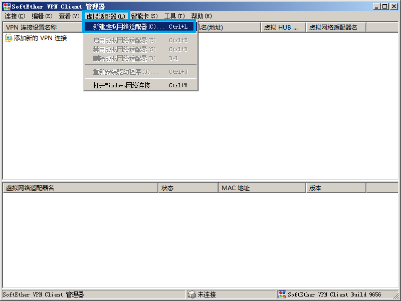

## SoftEther VPN

官网 <https://www.softether.org>


---


### Linux 客户端


安装

1. 到官网下载预编译的源码包，自行编译安装
2. 使用我编译并打包好的rpm包
   1. [vpnserver-99.4.25_2018-1.x86_64.rpm](https://download.liuq.org/softether.org/vpnserver-99.4.25_2018-1.x86_64.rpm)
   2. [vpnclient-99.4.25_2018-1.x86_64.rpm](https://download.liuq.org/softether.org/vpnclient-99.4.25_2018-1.x86_64.rpm)
   3. 安装后会自行启动守护进程
   4. 安装目录是 `/usr/local/{vpnserver,vpnclient}`
   5. 没有自启，需要自行添加 `/usr/local/{vpnserver,vpnclient} start`  到 `/etc/rc.local`
   6. 不会记录日志，日志是重定向到 `/dev/null`
   7. 卸载将会删除本rpm的所有程序文件和配置文件


vpncmd 常用命令

网卡

```
创建 NicCreate
删除 NicDelete
查看 NicList
```

连接

```
创建 AccountCreate
密码 AccountPasswordSet
删除 AccountDelete
自连 AccountStartupSet
连接 AccountConnect
断开 AccountDisconnect
查看 AccountList
```


---


### Windows 客户端


安装和使用文档

1. 下载软件 [softether-vpnclient-v4.29-9680-rtm-2019.02.28-windows-x86_x64-intel.exe](https://download.liuq.org/softether.org/softether-vpnclient-v4.29-9680-rtm-2019.02.28-windows-x86_x64-intel.exe)

2. 点击下载后的软件执行安装

3. 下一步  
   

4. 下一步  
   

5. 下一步  
   

6. 下一步  
   

7. 下一步  
   

8. 下一步，然后等待几秒  
   

9. 完成  
   

10. 新建虚拟网卡  
    

11. 确认，然后等待几秒  
    

12. 创建连接  
    

13. 填写提供的信息并确认  
    

14. 连接  
    


