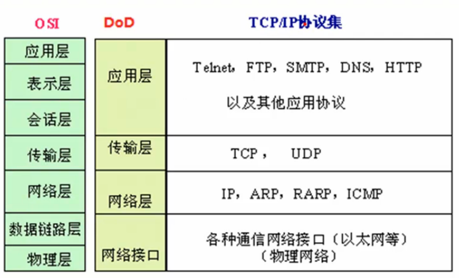

#### OSI 和 DoD 模型



OSI 模型应用与 C/S 和 B/S 结构上

OSI 模型将整体系统结构拆分成多个独立且相互连接的模块，每个模块都不可缺少，模块化的好处有很多，就像 IPv4 过渡到 IPv6，这只是网络层的这个模块的变化，不会影响上层的协议及应用，也不会牵扯到底层的网络硬件设备

* 应用层           使能产生网络流量的程序
* 表示层           在传输前加密或压缩数据
* 会话层           使之传输前建立会话，传输完毕关闭会话，可检查木马
* 传输层           实现可靠传输及不可靠传输
* 网络层           选择最佳网络设备节点中的路径，规划 IP 地址\( IPv4 or IPv6\)
* 数据链路层   定义帧的开始与结尾，透明传输，差错校验
* 物理层          定义了网络设备的行业标准

> 数据链路层：  
>         例如：定义帧的开始与结尾是一串定义好的 bit 位，比如1100开始，1010结尾，那么传输一串 bit 中包含的数据为 1100 111111111111 1010 11111111 1010 中，有的数据会与 1100 开始帧或 1010 结尾帧相同，一般会认为在中间第一个出现的结尾帧相识的就是结尾帧，但是这就出错了，真实的情况是会根据的数据帧做对比，得到真实的结尾帧和开始帧，会在这个伪帧进入网络设备后在此伪帧上做一个标识，使之能表示出来，在去掉此伪帧标识传送给下一个网络设备或目的主机
>
> 物理层：  
>         接口标准：就像 A 公司生产的网卡只能使用 4 条线，但是 B 公司生产的网卡使用 6 条线  
>         电压标准：A 公司网卡 0V 表示二进制 0，5V 表示二进制 1，B 公司 0V 等 0，50V 表示二进制 1，这 2 个网卡不能连接

* **TCP：传输控制协议（进行可靠传输）**
  * 采用 C/S 模式传输（client/server）
    * client：主动发起连接建立的程序
    * server：被动等待连接建立的程序
  * 应用场景：
    * 例如 Host A 要传送一个 500M 大小的文件给 Host B，A 需要将这个大文件拆分为多个带编号的小数据包，依次传输每个包至 B，B 收到很多带编号的小数据包，需要依据编号将多个小数据包组合起来，但是有很多包在传输，可能会漏掉 1~2 个包，TCP 协议就负责将丢掉的包重新传输，实现了可靠传输
  * 网络环境是不可靠的，但是传输层的协议是可靠的，也能达到传输目的
  * 传输过程（状态）：建立连接 &gt; 数据传送 &gt; 释放连接
* **UDP：用户数据报协议（进行不可靠传输）**
  * 应用场景：
    * 例如 Host A 和 Host B 在聊天，A 发送一段文字至 B，这段文字一个包就能封装，直接传输一个包，实现不可靠传输

---

#### TCP/IP 协议


数据包的封装过程


```
├── 目标MAC地址与源MAC地址
│   └── 目标IP与源IP
│       ├── 目标port与源port
│       └── 数据
└── FCS(校验和)
```

计算机在接收到数据帧的时候，需要去掉为了传输而增加的附加信息，称之为解封装，是上述操作的逆向过程

> 传输原理类似于寄送快递，需要填写本人手机号姓名和地址，及收件人的手机号姓名和地址，收件人收到货物后扔掉快递包裹快递单这些没用的东西，取出包裹里面真正需要的物品

---

#### TCP 报文段的首部格式（32 bit）


---

#### 应用层协议和服务的关系


```
admin.~ > lsof -i:80
COMMAND    PID    USER   FD   TYPE DEVICE SIZE/OFF NODE NAME
chromium  2634 liuq369  160u  IPv4 560523      0t0  TCP 192.168.1.102:46905->116.211.167.193:80 (ESTABLISHED)
editor   19068 liuq369   81u  IPv4 517447      0t0  TCP 192.168.1.102:53788->104.25.213.20:80 (ESTABLISHED)
```

---

#### TCP 的连接建立

TCP/IP 三次握手建立连接，三次通信理论上是最小值，是为了在不可靠的网络环境上实现可靠传输


为了解决网络中存在延迟的问题：

client 发出的第一个连接请求，在网络中延迟了一段时间，client 以为是 server 没有回应它的请求，所以 client 第二次发出连接请求，顺利到达 server，server 就确认回复 client，连接建立，但是之前发出的第一个连接请求在路途中到了 server，server 又第二次回复client 的连接请求，client 认为反正 server 已经和它建立连接，client 认为这个连接请求无效，就一直不回复 server，server 一直收不到 client 的回复，就是一个死循环，一直消耗 server 的资源，采用三次握手的方法可以防止这种现象发生

> [TCP 为什么是三次握手？](#)

---

#### 性能指标

* 速率
* 带宽
* 吞吐量
* 时延
* 时延带宽积
* 往返时间
* 利用率


