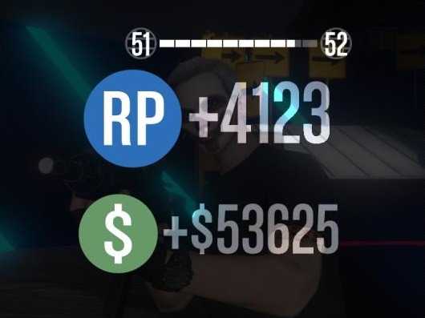

## 自动化挂机



>   来源 <https://youtu.be/4aYK652ych0>


明细：

*   单次 $53,000+4,000RP，耗时26分钟
*   一晚上8小时，(8*60)/26
*   一晚上能挂机18个回合，($53,000+4,000RP)*18
*   一晚上总收入 $954,000+52,000RP
    *   坚持一周的话总收入 $6,678,000+364,000RP
    *   坚持一月的话总收入 $28,620,000+1,560,000RP

优点：

*   有钱有经验
*   单人也可以
*   挂机内不需要手动操作

缺点：

*   网不好也需要挂着加速器
*   需要抢占鼠标和键盘，这段时间不能使用电脑，所以最好是晚上挂机
*   需要保持游戏在线
*   有点费电

操作：

1.  收藏差事 <https://zh-cn.socialclub.rockstargames.com/job/gtav/DQ5597ZwJkuJBpWJ93-GTw>
2.  安装工具 <https://www.autohotkey.com/download/ahk-install.exe>
3.  创建脚本文件到桌面，ahk后缀的文件
4.  进入游戏，显示设置，分辨率改为最小
5.  重新启动游戏
    1.  进入线上模式
    2.  被动模式 - 防止被抢钱
    3.  手动启动收藏的差事
    4.  双击启动桌面的脚本文件
    5.  马上点击到游戏界面，因为一会儿将开始自动挂机操作
6.  关闭显示器和音响
7.  挂机成功
8.  挂机结束后第一件事是打开手机存现金到银行 - 防止被抢


## 脚本

```
;; 保存为ahk后缀文件
;; 双击执行

MsgBox, 4, 消息, 是否使用浏览器打开文档
IfMsgBox Yes
	Run, "https://liuq.org/doc/?/games/PC GTA5 Online 自动化差事挂机赚钱和经验"

MsgBox, 4, GTA5 Online 挂机, 点击 “是” 之后，本脚本将自动允许，须10秒内鼠标激活到游戏窗口
IfMsgBox NO
	Exit

sleep 10 * 1000
loop
{
    Send, {w down}
    sleep 100
    Send, {w up}
    
    sleep 200
    
    Send, {Enter down}
    sleep 100
    Send, {Enter up}
    
	sleep 15 * 1000
}
```

