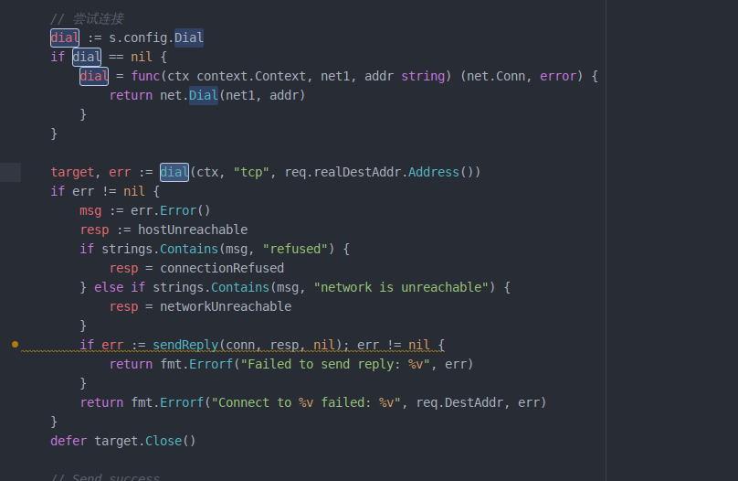
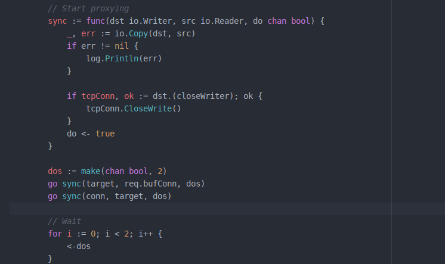

## 数据转换

### 数字转换为字节

uint8 转 byte

```go
func Uint8toByte(i uint8) []byte {
	var buf = make([]byte, 1)
	buf[0] = byte(i)
	return buf
}
```

uint16 转 byte

```go
func Uint16toBytes(i uint16) []byte {
	var buf = make([]byte, 2)
	binary.LittleEndian.PutUint16(buf, i)
	return buf
}
```

uint32 转 byte

```go
func Uint32toBytes(i uint32) []byte {
	var buf = make([]byte, 4)
	binary.LittleEndian.PutUint32(buf, i)
	return buf
}
```

uint64 转 byte

```go
func Uint32toBytes(i uint64) []byte {
	var buf = make([]byte, 8)
	binary.LittleEndian.PutUint64(buf, i)
	return buf
}
```


### 字节转换为数字

byte 转 uint8

```go
func BytetoUint8(i []byte) uint8 {
   return uint8(i[0])
}
```

byte 转 uint16

```go
func BytetoUint16(i []byte) uint16 {
	var buf [2]byte
	buf[0] = i[1]
	buf[1] = i[0]
	return binary.BigEndian.Uint16(buf[:])
}
```


## 字节拼接

```go
buf := make([][]byte, 4)
buf[0] = slave.mode[:]
buf[1] = slave.taskID[:]
buf[2] = slave.nameL[:]
buf[3] = slave.name
data := bytes.Join(buf, []byte{})
```


## 字符串替换

```
# 将字符串 "_" 下划线替换为 ";" 分号

str := strings.Replace(info, "_", ";", -1)
```


## 编译 win32 平台

```
CGO_ENABLED=0 GOOS=windows GOARCH=386 go build
```


## 特殊匿名函数




## 经典并发实例



