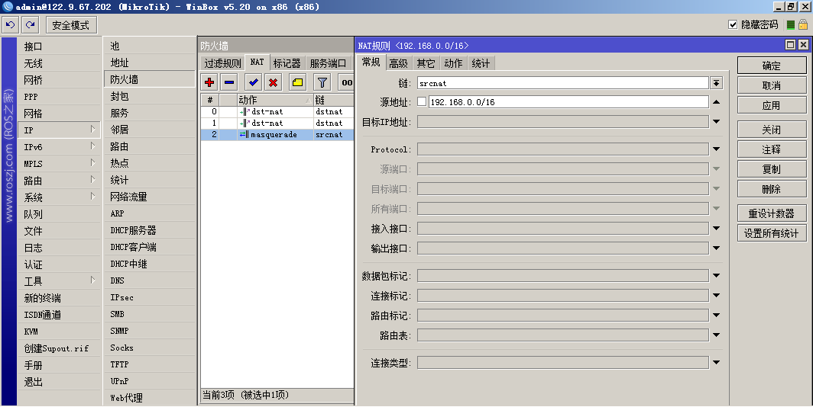
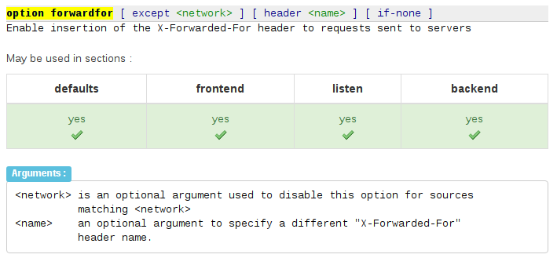

#### 一、入口软路由禁用 ip源地址转换



1. ip -&gt; Firewall -&gt; NAT -&gt; Chain=srcnat 禁用或删除掉
2. ip -&gt; Firewall -&gt; NAT -&gt; Chain=srcnat 配置详细规则

否则应用服务器最多只能获取此软路由的内网 IP

因为最开始客户端连接软路由的公网ip，先建立tcp握手连接，但是开启了 snat，ip包中的客户端 源IP 将会改变为此路由的内网 IP，后面的其他机器无论如何都只能获取到路由的 IP，因为客户端传过来的 TCP/IP 包的源地址已经被改写，除非禁用改写数据包功能

当然，如果禁用改写数据包功能，那么内网的机器将不能主动访问互联网，这不是一个完美的结果，所以只能选择第二条，只有符合过滤条件的包才会做 snat，这样公网进来的包将不符合条件，不会做 snat，就能获取 tcp/ip 中的源地址，则内网中的机器访问互联网则符合条件，做 snat，将能访问互联网了

#### 二、HAProxy 分发器转发 X-Forwarded-For



启用http头 X-Forwarded-For 信息转发

#### 三、nginx 应用获取

```
...
http {
    ...

    # 信任此机器发送过来 http 头中的 X-Forwarded-For
    # 必须包含从入口经过 http 协议请求的源主机，前提是信任它
    # 此机器必须是内网机器、高防或 CDN

    set_real_ip_from  192.168.1.11;
    set_real_ip_from  192.168.1.12;
    set_real_ip_from  192.168.1.201;
    set_real_ip_from  192.168.1.202;
    real_ip_header    X-Forwarded-For;
    ...
}
```
