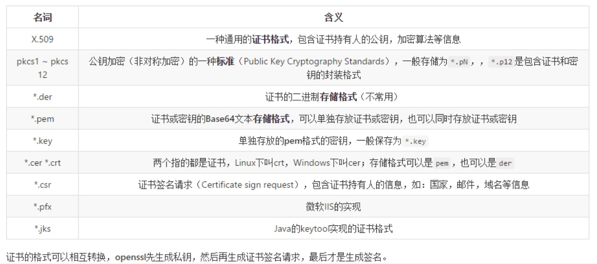

---

自签名证书（先创建 私钥，然后根据 私钥 生成 公钥。）

```
openssl genrsa -out null.pem 1024
openssl req -x509 -days 7300 -new -key null.pem -out null.crt -subj '/CN=null'

# cat server.crt server.pem >kkkk 合体
```

* null.pem （私钥）
* null.crt （公钥/证书）

---

转换为 pem 格式证书

```
openssl rsa -in private.key -out private.pem
```

---

#### 创建 服务端和客户端 私钥及公钥

```
openssl genrsa -out cakey.pem 2048
openssl req -new -x509 -days 1095 -key cakey.pem -out cacert.pem -sha256 -subj "/CN=test.liuq.org CA"
openssl genrsa -out serverkey.pem 2048
openssl genrsa -out clientkey.pem 2048
openssl req -new -key serverkey.pem -out serverkey.csr -subj "/CN=test"
openssl req -new -key clientkey.pem -out clientkey.csr -subj "/CN=test"
openssl x509 -req -days 365 -in clientkey.csr -CA cacert.pem -CAkey cakey.pem -set_serial 1 -out clientcert.pem
openssl x509 -req -days 365 -in serverkey.csr -CA cacert.pem -CAkey cakey.pem -set_serial 94345 -out servercert.pem
rm -f serverkey.csr
rm -f clientkey.csr
```

```
serverkey.pem     服务器密钥
servercert.pem    服务器证书

clientkey.pem     客户机密钥
clientcert.pem    客户机证书
```

> 参考
>
> [IBM 使用 TLS 进行远程管理](https://www.ibm.com/support/knowledgecenter/zh/linuxonibm/liabp/liabpkvmsecsrmtls.htm)  
> [为 TLS 设置 libvirt（加密和认证）](https://wiki.libvirt.org/page/TLSCreateServerCerts)

---

# -subj

| 提示 | 内容 | 值 |
| :--- | :--- | :--- |
| \(2 letter code\) \[AU\]: | 国家 | 选填 C |
| \(full name\) \[Some-State\]: | 洲/省 | 选填 ST |
| \(eg, city\) \[ \]: | 城/镇 | 选填 L |
| \[Internet Widgits Pty Ltd\]: | 组织名 | 选填 O |
| \(eg, section\) \[ \]: | 单位名 | 选填 OU |
| \(eg, YOUR name\) \[ \]: | 完整域名 | 必填 CN \* |
| Email Address \[ \]: | 邮箱 | 选填 emailAddress |

[http://www.cnblogs.com/wjoyxt/p/3774148.html](http://www.cnblogs.com/wjoyxt/p/3774148.html)

man openssl-req /req\_distinguished\_name

