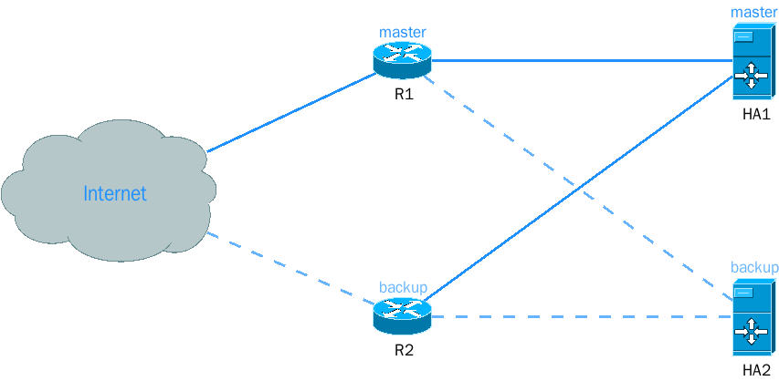

#### 拓扑结构


环境

```
R1公网IP：192.168.2.1    R1内网IP：192.168.75.1    HA1 IP：192.168.1.11 vip：192.168.75.16/192.168.75.19
R2公网IP：192.168.2.2    R2内网IP：192.168.75.254  HA2 IP：192.168.1.12 vip：192.168.75.16/192.168.75.19
```

#### 实现

```
访问主要线路：R1 - IP：10.0.0.1，端口 80/443 访问网站，映射端口到 vip：192.168.75.16 端口 80/443
访问备用线路：R2 - IP：10.0.0.2，端口 80/443 访问网站，映射端口到 vip：192.168.75.19 端口 80/443

HA1 - 默认网关：192.168.75.1，备用网关：192.168.75.254
HA1 - 添加备用网关
    ip route flush table 99
    ip route add default via 192.168.75.254 dev em1 table 99
    ip rule add from 192.168.75.19 table 99

HA2 - 默认网关：192.168.75.254，备用网关：192.168.75.1
HA2 - 添加备用网关
    ip route flush table 99
    ip route add default via 192.168.75.1 dev em1 table 99
    ip rule add from 192.168.75.16 table 99
```


