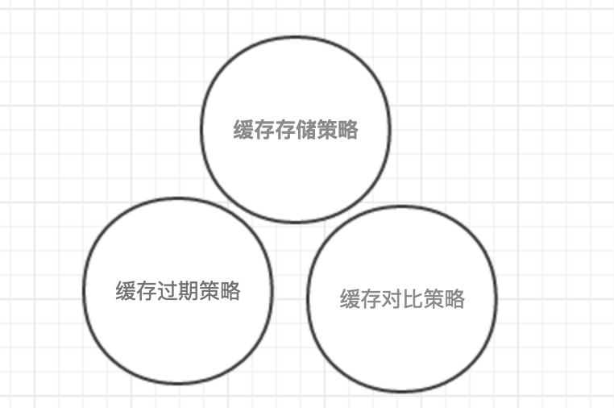

#### HTTP 缓存



##### 一、缓存存储策略

用于决定 Http 响应内容是否可缓存到客户端

```
Cache-control: public          - 可以被任何对象缓存，（包括：发送请求的客户端，代理服务器，等等）
Cache-control: private         - 只能被单个用户缓存，不能作为共享缓存（即代理服务器不能缓存它）
Cache-control: no-cache        - 在释放缓存副本之前，强制高速缓存将请求提交给原始服务器进行验证
Cache-control: only-if-cached  - 客户端只接受已缓存的响应，并且不要向原始服务器检查是否有更新的拷贝
Cache-control: no-store        - 不应存储有关客户端请求或服务器响应的任何内容
Cache-control: no-transform    - 不得对资源进行转换或转变。Content-Encoding, Content-Range, Content-Type等HTTP头不能由代理修改。例如，非透明代理可以对图像格式进行转换，以便节省缓存空间或者减少缓慢链路上的流量。 no-transform指令不允许这样做
Cache-Control: must-revalidate - 缓存在考虑使用一个陈旧的资源时，必须先验证它的状态，已过期的缓存将不被使用
```

##### 二、缓存过期策略

决定客户端是否可直接从本地缓存数据中加载数据并展示

```
Cache-control: max-age=<seconds>      - 缓存存储的最大周期，超过这个时间秒缓存被认为过期，时间是请求的时间
Cache-control: s-maxage=<seconds>     - 覆盖max-age 或者 Expires 头，仅适用于共享缓存，私有缓存中被忽略
Cache-control: max-stale[=<seconds>]  - 客户端愿意接收一个已经过期的资源。可选的设置一个时间秒，表示响应不能超过的过时时间
Cache-control: min-fresh=<seconds>    - 表示客户端希望在指定的时间内获取最新的响应
```

##### 三、缓存对比策略


将缓存在客户端的数据标识发往服务端，服务端通过标识来判断客户端 缓存数据是否仍有效，进而决定是否要重发数据

1. 服务端首次响应时输出相应的头信息（Last-Modified、ETags）到客户端
2. 客户端检测到数据过期或浏览器刷新后，往往会重新发起一个 http 请求到服务器
3. 服务器此时并不急于返回数据，而是看请求头有没有带标识（ If-Modified-Since、If-None-Match）过来
4. 如果判断标识仍然有效，则返回304状态码告诉客户端取本地缓存数据来用即可

```
Last-Modified: <day-name>, <day> <month> <year> <hour>:<minute>:<second> GMT
是一个响应首部，包含源服务器认定的资源做出修改的服务器的日期时间

<day-name> - "Mon", "Tue", "Wed", "Thu", "Fri", "Sat" 或 "Sun" 之一 （区分大小写）
<day>      - 两位数字表示的天数, 例如"04" or "23"
<month>    - "Jan", "Feb", "Mar", "Apr", "May", "Jun", "Jul", "Aug", "Sep", "Oct", "Nov", "Dec" 之一（区分大小写）。
<year>     - 4位数字表示的年份, 例如 "1990" 或者"2016"。
<hour>     - 两位数字表示的小时数, 例如 "09" 或者 "23"。
<minute>   - 两位数字表示的分钟数，例如"04" 或者 "59"。
<second>   - 两位数字表示的秒数，例如 "04" 或者 "59"。
GMT        - 国际标准时间。HTTP中的时间均用国际标准时间表示，从来不使用当地时间
```

```
ETag
资源的特定版本的标识符，匹配版本则返回304，不向服务器拿数据，否则向服务器拿数据，并返回200

ETag: W/"<etag_value>" - 弱验证，很容易生成，但不利于比较。相同资源的两个弱Etag值可能语义相同，但不是资源每个字节都相同
ETag: "<etag_value>"   - 强验证，没有明确指定生成ETag值的方法。通常，使用内容的散列，最后修改时间戳的哈希值，或简单地使用版本号
```

```
If-Modified-Since: <day-name>, <day> <month> <year> <hour>:<minute>:<second> GMT
服务器只在所请求的资源在给定的时间之后对内容进行过修改才会将资源返回，状态码为 200
如果请求的资源从那时起未经修改，那么返回一个不带有消息主体的304响应

<day-name> - "Mon", "Tue", "Wed", "Thu", "Fri", "Sat" 或 "Sun" 之一 （区分大小写）
<day>      - 两位数字表示的天数, 例如"04" or "23"
<month>    - "Jan", "Feb", "Mar", "Apr", "May", "Jun", "Jul", "Aug", "Sep", "Oct", "Nov", "Dec" 之一（区分大小写）。
<year>     - 4位数字表示的年份, 例如 "1990" 或者"2016"。
<hour>     - 两位数字表示的小时数, 例如 "09" 或者 "23"。
<minute>   - 两位数字表示的分钟数，例如"04" 或者 "59"。
<second>   - 两位数字表示的秒数，例如 "04" 或者 "59"。
GMT        - 国际标准时间。HTTP中的时间均用国际标准时间表示，从来不使用当地时间
```

```
If-None-Match: <etag_value>
If-None-Match: <etag_value>, <etag_value>, …
If-None-Match: *
GET/HEAD请求方法，仅当服务器上没有任何资源的 ETag 属性值与这个首部中列出的相匹配的时候，服务器端会才返回所请求的资源，响应码为200
对于其他方法来说，仅当最终确认没有已存在的资源的 ETag 属性值与这个首部中所列出的相匹配的时候，才会对请求进行相应的处理。

<etag_value> - 表示所请求资源的标识。形式是采用双引号括起来的由 ASCII 字符串（如"675af34563dc-tr34"）
*            - 星号是一个特殊值，可以代表任意资源
```

#### 语法

Cache-Control：

指令不区分大小写，并且具有可选参数，可以用令牌或者带引号的字符串语法。多个指令以逗号分隔

#### 示例

```
禁止进行缓存
缓存中不得存储任何关于客户端请求和服务端响应的内容。每次由客户端发起的请求都会下载完整的响应内容。

Cache-Control: no-store
Cache-Control: no-cache, no-store, must-revalidate


强制确认缓存
如下头部定义，此方式下，每次有请求发出时，缓存会将此请求发到服务器（译者注：该请求应该会带有与本地缓存相关的验证字段），服务器端会验证请求中所描述的缓存是否过期，若未过期（注：实际就是返回304），则缓存才使用本地缓存副本。

Cache-Control: no-cache


```

> ```
> https://developer.mozilla.org/zh-CN/docs/Web/HTTP/Headers/Cache-Control
> https://segmentfault.com/a/1190000008956069
> ```


